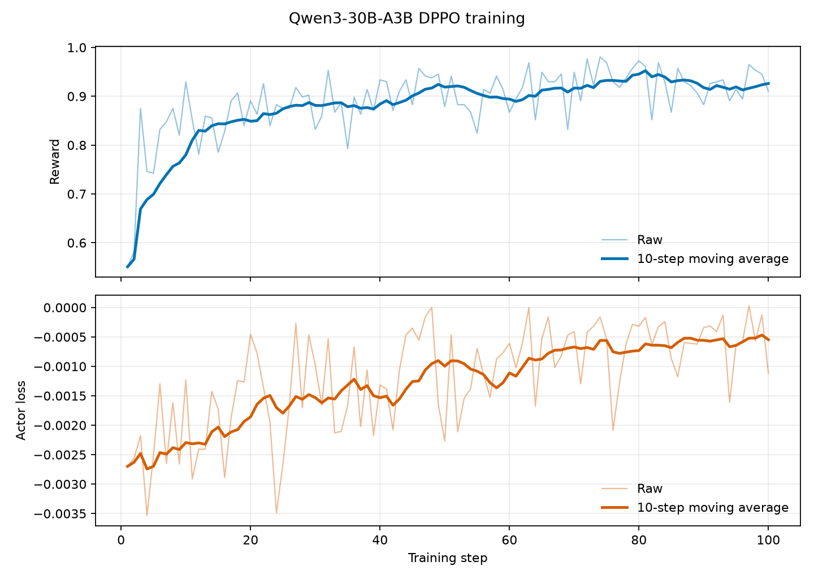

# Qwen3-30B-A3B DPPO on Ascend

对应任务：[verl-ascend-recipe #15](https://github.com/verl-project/verl-ascend-recipe/issues/15)

## Required `verl` version

版本快照与安装命令见 [`REQUIRED_VERL.txt`](REQUIRED_VERL.txt)。依赖版本按该 revision 的官方 Ascend 环境要求配置。

## 1. 交付概览

本 recipe 提供 Qwen3-30B-A3B 的 DPPO-Binary-TV Ascend 训练入口。训练侧使用 Megatron actor/reference 与 MindSpeed，rollout 侧使用 vLLM-Ascend，统一入口为 `verl.trainer.main_ppo`。

| 项目 | 配置 |
| --- | --- |
| 模型 | Qwen/Qwen3-30B-A3B |
| 数据集 | GSM8K parquet |
| 算法 | DPPO-Binary-TV |
| 训练后端 | Megatron actor/reference + MindSpeed |
| rollout 后端 | vLLM-Ascend |
| 验证平台 | Atlas 800T A2，4 x Ascend 910B |
| 训练规模 | 100 global steps |
| 运行脚本 | `dppo/run_qwen3_30b_a3b_dppo_megatron_npu.sh` |

## 2. 适配方案

DPPO-Binary-TV 通过以下配置启用：

```text
algorithm.adv_estimator=grpo
algorithm.norm_adv_by_std_in_grpo=False
actor_rollout_ref.actor.policy_loss.loss_mode=dppo_tv
actor_rollout_ref.actor.loss_agg_mode=seq-mean-token-sum-norm
actor_rollout_ref.actor.clip_ratio_low=0.15
actor_rollout_ref.actor.clip_ratio_high=0.15
model_engine=megatron
actor_rollout_ref.rollout.name=vllm
```

`dppo_tv` 使用 verl 已注册的 policy-loss 实现。vLLM-Ascend 完成 rollout，GSM8K rule scorer 计算 reward，GRPO estimator 生成 advantage，Megatron actor 通过统一 policy-loss 调用链执行 DPPO 更新，随后将权重同步到 rollout engine。

```text
GSM8K prompts
      |
      v
vLLM-Ascend TP4 rollout
      |
      v
rule reward + GRPO advantage
      |
      v
DPPO-Binary-TV policy loss
      |
      v
Megatron PP4 actor update
      |
      v
bucketed actor-to-rollout weight synchronization
```

### 2.1 关键训练配置

| 配置项 | 值 |
| --- | ---: |
| DPPO divergence threshold | 0.15 |
| train batch size | 64 |
| PPO mini batch size | 64 |
| PPO micro batch size per NPU | 4 |
| rollout/reference log-prob micro batch size per NPU | 4 |
| rollout responses per prompt | 4 |
| prompt / response length | 512 / 1024 |
| actor learning rate | `1e-5` |
| actor TP / PP / EP / ETP | 1 / 4 / 1 / 1 |
| rollout TP | 4 |
| optimizer CPU offload fraction | 0.40 |
| weight synchronization bucket | 640 MiB |
| vLLM max batched tokens / sequences | 8192 / 32 |
| graph mode | `FULL_DECODE_ONLY` |
| graph capture sizes | 1, 2, 4, 8, 16, 32 |
| training steps | 100 |

## 3. 环境与数据准备

### 3.1 依赖

按 [`verl/main` Ascend 安装指南](https://github.com/verl-project/verl/blob/main/docs/ascend_tutorial/get_start/install_guidance.rst)配置 vLLM + Megatron 支持组合：

| 组件 | 要求 |
| --- | --- |
| verl | 使用 [`REQUIRED_VERL.txt`](REQUIRED_VERL.txt) 记录的 revision |
| Python | `>=3.10, <3.13`，推荐 3.12 |
| CANN | 9.1.0 |
| torch / torch_npu | 2.10.0 / 2.10.0.post4 |
| vLLM / vLLM-Ascend | 0.23.0 / 0.23.0 |
| Megatron-LM / MindSpeed | core_r0.16.0 / core_r0.16.0 |

从 `verl-ascend-recipe` 根目录安装版本快照，并使用 verl 提供的脚本配置训练、推理和权重同步依赖：

```bash
source /usr/local/Ascend/ascend-toolkit/set_env.sh
source /usr/local/Ascend/nnal/atb/set_env.sh

conda create -n verl-dppo python=3.12 -y
conda activate verl-dppo

./install_verl.sh --recipe dppo --method git --dest /path/to/verl --yes
bash /path/to/verl/scripts/install_vllm_mcore_npu.sh
```

### 3.2 模型与数据

准备 `Qwen/Qwen3-30B-A3B` 权重，并在 verl 根目录生成 GSM8K parquet：

```bash
python3 examples/data_preprocess/gsm8k.py \
  --local_save_dir /path/to/data/gsm8k
```

数据目录应包含：

```text
/path/to/data/gsm8k/train.parquet
/path/to/data/gsm8k/test.parquet
```

## 4. 运行、日志与恢复

进入上一步安装的 verl 根目录，启动 4 NPU、100-step 训练：

```bash
cd /path/to/verl

MODEL_PATH=/path/to/Qwen3-30B-A3B \
TRAIN_FILE=/path/to/data/gsm8k/train.parquet \
VAL_FILE=/path/to/data/gsm8k/test.parquet \
MEGATRON_LM_PATH=/path/to/Megatron-LM \
NDEVICES_PER_NODE=4 \
TOTAL_TRAINING_STEPS=100 \
bash /path/to/verl-ascend-recipe/dppo/run_qwen3_30b_a3b_dppo_megatron_npu.sh
```

额外参数会继续作为 Hydra overrides 传给 `verl.trainer.main_ppo`。控制台日志默认写入 `$PWD/logs/training_<timestamp>.log`，可通过 `LOG_DIR` 或 `LOG_FILE` 覆盖。

默认不周期保存 checkpoint。需要保存与续训时设置：

```bash
SAVE_FREQ=10 \
CHECKPOINT_DIR=/path/to/checkpoints/qwen3_30b_a3b_dppo \
RESUME_MODE=auto \
bash /path/to/verl-ascend-recipe/dppo/run_qwen3_30b_a3b_dppo_megatron_npu.sh
```

## 5. 100-step 长跑结果

本次训练在 Atlas 800T A2 的 4 x Ascend 910B 上连续完成 100/100 global steps。

| 指标 | 结果 |
| --- | ---: |
| 连续训练步数 | 100 / 100 |
| 100-step 累计 step 时间 | 10:31:52 |
| reward 首 10 步均值 | 0.780078 |
| reward 末 10 步均值 | 0.926172 |
| reward 首尾窗口增量 | +0.146094 |
| reward 线性斜率 | +0.001359 / step |
| generation throughput | 988.49 tokens/s（4 NPU） |
| end-to-end throughput | 404.37 tokens/s（4 NPU） |
| 平均 step 时间 | 379.12 s |
| actor 峰值 allocated / reserved HBM | 43.53 / 46.68 GiB/NPU |

generation throughput 按非 aborted response token 数除以 rollout generation 时间计算；end-to-end throughput 按全部 step 的 `perf/total_num_tokens` 总和除以 `timing_s/step` 总和计算。

本次容器共享内存为 64 MiB，无法容纳 640 MiB weight-transfer bucket，权重同步使用 file-backed `mmap`；相关开销已计入端到端结果。

### 5.1 长跑曲线

下图覆盖完整 100 steps，上图为 `critic/score/mean` reward，下图为 `actor/loss`。两项指标均展示原始值和 10-step moving average。



## 6. 复现证据与验收结论

100-step 完整训练日志：
[training_100step.log](https://gist.githubusercontent.com/RordChang/e72974de836081ae92c8f1e315fd58a3/raw/training_100step.log)

| Issue #15 验收项 | 本次结果 |
| --- | --- |
| 完成 100 steps 或运行 12 小时 | 完成连续 100/100 steps |
| reward 上升 | 首 10 步均值 0.780078，末 10 步均值 0.926172 |
| 无 GPU 标杆时 TPS > 100 | 4 NPU end-to-end throughput 404.37 tokens/s |
| 提供算法适配调优文档 | 本文包含适配设计、环境、数据、命令、checkpoint/resume、指标和曲线 |

本次结果覆盖 Issue #15 的长跑、reward、性能和实践文档验收项，并提供 Qwen3-30B-A3B 在 Megatron + vLLM-Ascend 组合上的完整复现入口。
