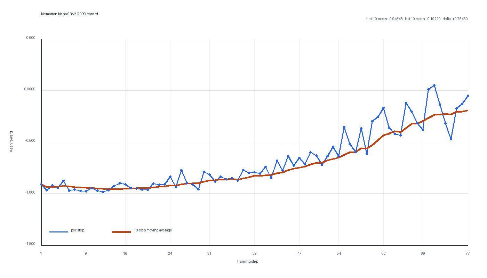
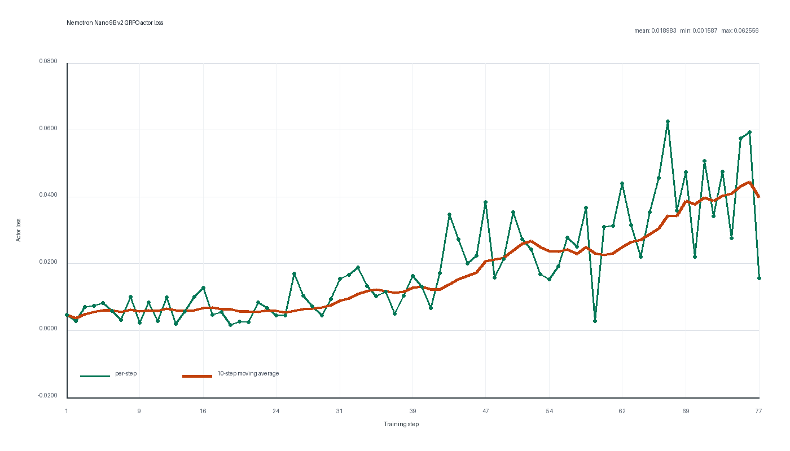

# NVIDIA Nemotron Nano 9B v2 GRPO Ascend Recipe

对应任务：[verl-ascend-recipe #70](https://github.com/verl-project/verl-ascend-recipe/issues/70)

本目录提供 NVIDIA Nemotron Nano 9B v2 在 Ascend NPU 上执行 GRPO 训练的可复现配置。训练侧使用 Megatron，rollout 侧使用 vLLM-Ascend。验收运行使用 8 张 Ascend 910B3，从初始权重连续训练 13 小时 00 分 09 秒，完成 77 个 optimizer steps。

## 训练链路

训练通过 `verl.trainer.main_ppo` 统一调度：

```text
DAPO-Math prompts -> vLLM-Ascend TP8 async rollout (16 responses/prompt)
                  -> DAPO rule reward -> GRPO advantage
                  -> Megatron TP8 actor update -> rollout weight synchronization
```

实现沿用 `verl` 的 [Nemotron Nano Megatron GRPO 示例](https://github.com/verl-project/verl/blob/main/examples/grpo_trainer/run_nemotron_nano_v3_30b_a3b_megatron.sh)。针对 Nemotron Nano 9B v2 的 Mamba2 层，脚本通过 `VERL_USE_EXTERNAL_MODULES` 加载运行时临时模块：训练与 prefill 使用 MindSpeed-LLM 的 NPU SSD 实现，单 token decode 使用可被 `FULL_DECODE_ONLY` 图模式捕获的 NPU tensor 路径。兼容逻辑全部包含在启动脚本中，不需要额外的 recipe 源码 patch。

## 文件

| 路径 | 内容 |
| --- | --- |
| `run_nemotron_nano_9b_v2_grpo_megatron_npu.sh` | 8 NPU 环境、Mamba2 运行时适配、Megatron/vLLM-Ascend 参数与训练入口 |
| `assets/reward_curve.png` | reward 逐步值与 10-step moving average |
| `assets/loss_curve.png` | actor loss 逐步值与 10-step moving average |
| `README.md` | 环境、数据、复现配置、指标定义与验收结果 |

## 环境

验收环境使用 `verl/main` Ascend vLLM + Megatron 官方依赖组合：

| 组件 | 版本或配置 |
| --- | --- |
| NPU | 8 x Ascend 910B3 |
| OS | Ubuntu 22.04 |
| HDK / CANN | 26.0.rc1 / 9.1.0 |
| Python | 3.12 |
| PyTorch / torch_npu | 2.10.0 / 2.10.0.post4 |
| transformers | 5.10.4 |
| vLLM / vLLM-Ascend | 0.23.0 / 0.23.0 |
| Triton / Triton-Ascend | 3.5.0 / 3.2.2 |
| Megatron Core / Megatron Bridge | 0.18.3 / 0.5.0 |
| MindSpeed / MindSpeed-LLM | 0.18.0 / 26.0.0.dev0 |
| verl | `main` |

按照 [`verl` Ascend 安装指南](https://github.com/verl-project/verl/blob/main/docs/ascend_tutorial/zh/get_start/install_guidance.rst)创建独立 Conda 环境：

```bash
source /usr/local/Ascend/ascend-toolkit/set_env.sh
source /usr/local/Ascend/nnal/atb/set_env.sh

conda create -n verl-vllm-npu python=3.12 -y
conda activate verl-vllm-npu

git clone --recursive https://github.com/verl-project/verl.git
bash verl/scripts/install_vllm_mcore_npu.sh
```

在同一环境按照 [MindSpeed-LLM 官方安装文档](https://github.com/Ascend/MindSpeed-LLM/blob/master/docs/zh/pytorch/training/install_guide.md)安装 MindSpeed-LLM，然后验证关键组件：

```bash
python -c 'import torch_npu, vllm, mindspeed, mindspeed_llm'
```

## 模型与数据

下载模型：

```bash
hf download nvidia/NVIDIA-Nemotron-Nano-9B-v2 \
  --local-dir /path/to/NVIDIA-Nemotron-Nano-9B-v2
```

下载训练集与验证集：

```bash
hf download BytedTsinghua-SIA/DAPO-Math-17k \
  --repo-type dataset \
  --local-dir /path/to/dapo-math-17k

hf download BytedTsinghua-SIA/AIME-2024 \
  --repo-type dataset \
  --local-dir /path/to/aime-2024
```

本次运行使用：

- 模型：[nvidia/NVIDIA-Nemotron-Nano-9B-v2](https://huggingface.co/nvidia/NVIDIA-Nemotron-Nano-9B-v2)
- 训练集：[BytedTsinghua-SIA/DAPO-Math-17k](https://huggingface.co/datasets/BytedTsinghua-SIA/DAPO-Math-17k) 的 `data/dapo-math-17k.parquet`
- 验证集：[BytedTsinghua-SIA/AIME-2024](https://huggingface.co/datasets/BytedTsinghua-SIA/AIME-2024) 的 `data/aime-2024.parquet`
- reward manager：`dapo`

## 运行

从 `verl` 仓库根目录启动 8 卡训练：

```bash
ASCEND_RT_VISIBLE_DEVICES=0,1,2,3,4,5,6,7 \
RAY_DATA_HOME=/path/to/workspace \
MODEL_PATH=/path/to/NVIDIA-Nemotron-Nano-9B-v2 \
TRAIN_FILE=/path/to/dapo-math-17k/data/dapo-math-17k.parquet \
TEST_FILE=/path/to/aime-2024/data/aime-2024.parquet \
CKPTS_DIR=/path/to/checkpoints/nemotron-nano-9b-v2-grpo \
TOTAL_TRAINING_STEPS=100 \
SAVE_FREQ=100 \
TEST_FREQ=-1 \
RESUME_MODE=disable \
VERL_USE_UV=0 \
bash /path/to/verl-ascend-recipe/grpo/nemotron-nano-9b-v2/run_nemotron_nano_9b_v2_grpo_megatron_npu.sh
```

脚本接受额外 Hydra overrides，可直接追加在命令末尾。

## 关键配置

| 参数 | 验收值 |
| --- | ---: |
| train batch size | 32 |
| responses per prompt | 16 |
| 每步 rollout trajectories | 512 |
| PPO mini / micro batch size | 32 / 8 |
| reference / rollout log-prob micro batch size | 4 / 4 |
| max prompt / response length | 2048 / 1024 |
| overlong buffer length | 512 |
| actor / rollout | Megatron / vLLM-Ascend async |
| train / rollout TP | 8 / 8 |
| PP / EP / ETP | 1 / 1 / 1 |
| rollout max sequences | 512 |
| rollout memory utilization | 0.40 |
| chunked prefill / prefix caching | true / false |
| dtype | BF16 |
| dynamic batch size | false |
| parameter / optimizer offload | false / true |
| actor learning rate / warmup steps | 1e-6 / 10 |
| graph mode | `FULL_DECODE_ONLY` |
| graph capture sizes | 1, 2, 4, 8, 16, 32, 64, 128, 256, 512 |
| save / test frequency | 100 / -1 |
| 目标训练步数 | 100 |

周期验证关闭，因此 TPS 与 step time 不包含额外 evaluation 时间。

## Checkpoint 与日志

脚本默认 `SAVE_FREQ=100`、`RESUME_MODE=disable`，仅在第 100 步保存最终 checkpoint，不写入中间 checkpoint。调试续训时可以显式设置：

```bash
CKPTS_DIR=/path/to/checkpoints/nemotron-nano-9b-v2-grpo \
SAVE_FREQ=100 \
RESUME_MODE=auto \
bash /path/to/verl-ascend-recipe/grpo/nemotron-nano-9b-v2/run_nemotron_nano_9b_v2_grpo_megatron_npu.sh
```

正式验收数据来自 `RESUME_MODE=disable` 的 fresh run。训练指标由 console logger 输出；完整脱敏训练日志：[nemotron_nano_9b_v2_grpo_8npu.log](https://gist.github.com/OnPathXD/cedd7535f7d5a996fca748e7e94cc7da)。

## 指标定义

| 指标 | 计算方式 |
| --- | --- |
| reward | `critic/rewards/mean`；比较首 10 步和末 10 步均值 |
| actor loss | `actor/loss` 的逐步值、全程均值和范围 |
| 单 NPU TPS | `perf/throughput` 的 77 步算术均值 |
| 8 NPU TPS | 单 NPU TPS 乘以 8 |
| step time | `timing_s/step` 的 77 步算术均值 |

## 13 小时验收结果

在 8 x Ascend 910B3 上从初始权重连续训练 13 小时 00 分 09 秒，共完成 77 个 optimizer steps：

| 指标 | 结果 |
| --- | ---: |
| 训练时长 / 完成步数 | 13 小时 00 分 09 秒 / 77 |
| reward 首 10 步均值 | -0.946484 |
| reward 末 10 步均值 | -0.192188 |
| reward 绝对增量 | +0.754297 |
| reward 全程线性斜率 | +0.011753 / step |
| actor loss 均值 / 范围 | 0.018983 / 0.001587 至 0.062556 |
| TPS | 935.5607 tokens/s（8 NPU），116.9451 tokens/s/NPU |
| 首 10 步单 NPU TPS 均值 / 最低值 | 124.4040 / 109.5558 tokens/s/NPU |
| 平均 step 时间 / 范围 | 599.9649 s / 511.9716 至 693.4601 s |
| 处理 token 总数 | 43,234,521 |

reward 的首尾窗口增量和全程线性斜率均为正，平均单 NPU TPS 高于 100 tokens/s。



Reward 曲线展示逐步原始值及 10-step moving average。



Actor loss 曲线展示逐步原始值及 10-step moving average。
