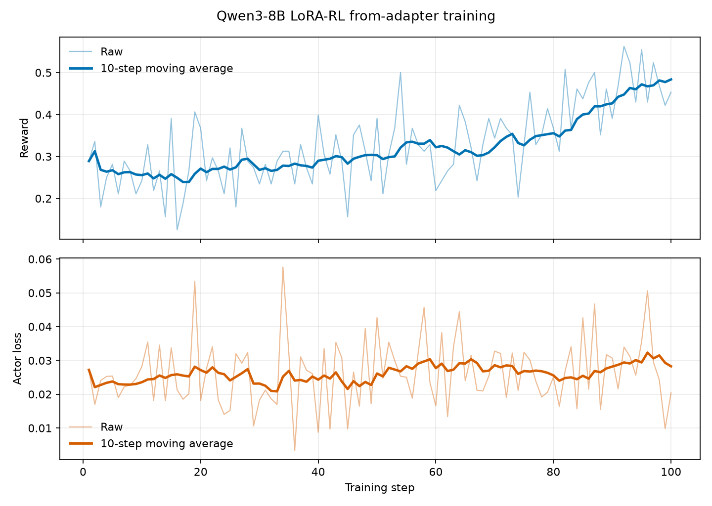

# Qwen3-8B LoRA-RL from adapter Ascend Recipe

对应任务：[verl-ascend-recipe #75](https://github.com/verl-project/verl-ascend-recipe/issues/75)

本目录提供 Qwen3-8B 从 PEFT LoRA adapter 继续执行 GRPO 训练的可复现配置。训练侧使用 FSDP，rollout 侧使用 vLLM-Ascend，运行平台为 Ascend NPU。

## 训练链路

训练通过 `verl.trainer.main_ppo` 统一调度：

```text
GSM8K prompts -> vLLM-Ascend LoRA rollout -> rule reward -> GRPO advantage
              -> FSDP LoRA actor update -> adapter weight synchronization
```

脚本从 `adapter_config.json` 读取 rank 与 alpha，并同时配置 FSDP 和 vLLM 的 LoRA 开关。adapter 由 `actor_rollout_ref.model.lora_adapter_path` 加载，reference policy 复用无 adapter 的 actor 基座权重。

## 文件

- `run_qwen3_8b_from_adapter_fsdp.sh`：训练启动脚本。
- `REQUIRED_VERL.txt`：`verl/main` 验证基线与安装命令。
- `assets/training_curves.png`：100 步 reward 与 actor loss 曲线。

## verl 版本

本 recipe 跟踪 `verl/main`，精确验证基线与安装命令见 [`REQUIRED_VERL.txt`](REQUIRED_VERL.txt)。

## 环境

推荐使用 [`verl/main` Ascend 安装指南](https://github.com/verl-project/verl/blob/main/docs/ascend_tutorial/get_start/install_guidance.rst)中的 vLLM + FSDP 支持组合：

| 组件 | 版本或配置 |
| --- | --- |
| 平台 | Atlas 800T A2，Ascend 910B |
| HDK / CANN | 26.0.rc1 / 9.1.0 |
| Python | 3.12 |
| PyTorch / torch_npu | 2.10.0 / 2.10.0.post4 |
| vLLM / vLLM-Ascend | 0.23.0 / 0.23.0 |
| verl | `main` |

使用 Conda 安装 FSDP 与 vLLM-Ascend 环境：

```bash
source /usr/local/Ascend/ascend-toolkit/set_env.sh
source /usr/local/Ascend/nnal/atb/set_env.sh

conda create -n verl-lora-rl python=3.12 -y
conda activate verl-lora-rl

git clone --recursive https://github.com/verl-project/verl.git
cd verl
USE_MEGATRON=0 bash scripts/install_vllm_mcore_npu.sh
```

运行前确认 `python -c 'import torch_npu, vllm, peft'` 成功。

## 模型、adapter 与数据

下载 Qwen3-8B：

```bash
hf download Qwen/Qwen3-8B --local-dir /path/to/Qwen3-8B
```

`LORA_ADAPTER_PATH` 指向 PEFT adapter 目录，目录中至少包含：

```text
/path/to/qwen3_8b_adapter/
├── adapter_config.json
└── adapter_model.safetensors
```

`LORA_ADAPTER_PATH` 可指向训练前已保存或通过 PEFT `save_pretrained` 导出的 LoRA adapter。

使用官方脚本生成 GSM8K parquet：

```bash
python examples/data_preprocess/gsm8k.py \
  --local_save_dir /path/to/data/gsm8k
```

训练集和验证集分别为 `train.parquet` 与 `test.parquet`，reward 由 GSM8K rule scorer 计算。

## 运行

从 `verl` 仓库根目录启动 Atlas 800T A2 8 卡训练：

```bash
MODEL_PATH=/path/to/Qwen3-8B \
LORA_ADAPTER_PATH=/path/to/qwen3_8b_adapter \
TRAIN_FILE=/path/to/data/gsm8k/train.parquet \
VAL_FILE=/path/to/data/gsm8k/test.parquet \
TOTAL_TRAINING_STEPS=100 \
bash /path/to/verl-ascend-recipe/lora/run_qwen3_8b_from_adapter_fsdp.sh
```

4 卡复现命令：

```bash
MODEL_PATH=/path/to/Qwen3-8B \
LORA_ADAPTER_PATH=/path/to/qwen3_8b_adapter \
TRAIN_FILE=/path/to/data/gsm8k/train.parquet \
VAL_FILE=/path/to/data/gsm8k/test.parquet \
NDEVICES_PER_NODE=4 \
TRAIN_BATCH_SIZE=32 \
PPO_MINI_BATCH_SIZE=32 \
ROLLOUT_TP=1 \
UPDATE_WEIGHTS_BUCKET_MEGABYTES=8 \
TOTAL_TRAINING_STEPS=100 \
bash /path/to/verl-ascend-recipe/lora/run_qwen3_8b_from_adapter_fsdp.sh
```

额外 Hydra overrides 可直接追加在脚本命令末尾。控制台日志默认写入 `$PWD/logs/training_<timestamp>.log`，可通过 `LOG_DIR` 或 `LOG_FILE` 覆盖。

## 关键配置

| 参数 | 8 卡默认值 | 4 卡实测值 |
| --- | ---: | ---: |
| LoRA rank / alpha | 从 adapter 读取 | 64 / 32 |
| train batch size | 64 | 32 |
| PPO mini batch size | 32 | 32 |
| responses per prompt | 4 | 4 |
| max prompt / response length | 512 / 1024 | 512 / 1024 |
| actor/reference | FSDP | FSDP |
| rollout | vLLM-Ascend TP1 | vLLM-Ascend TP1 |
| rollout max sequences | 32 | 32 |
| rollout max batched tokens | 8192 | 8192 |
| 权重同步分桶 (MiB) | 512 | 8 |
| vLLM graph mode | `FULL_DECODE_ONLY` | `FULL_DECODE_ONLY` |
| graph capture sizes | 1, 2, 4, 8, 16, 32 | 1, 2, 4, 8, 16, 32 |

## Checkpoint 与续训

脚本默认每 20 步保存 LoRA-only checkpoint，并保留最近两个 actor checkpoint。`RESUME_MODE=auto` 会从 `CHECKPOINT_DIR` 中最近的训练步继续：

```bash
CHECKPOINT_DIR=/path/to/checkpoints/qwen3_8b_lora_from_adapter \
SAVE_FREQ=20 \
RESUME_MODE=auto \
bash /path/to/verl-ascend-recipe/lora/run_qwen3_8b_from_adapter_fsdp.sh
```

初始 adapter 由 `LORA_ADAPTER_PATH` 加载；恢复同一训练任务时，模型、optimizer、scheduler 与 RNG 状态由 `CHECKPOINT_DIR` 恢复。

## 100 步结果

在 Atlas 800T A2（4 x Ascend 910B）上完成 100 个连续训练步：

| 指标 | 结果 |
| --- | ---: |
| reward 首 10 步均值 | 0.25547 |
| reward 末 10 步均值 | 0.48359 |
| reward 增量 | +0.22813 |
| TPS | 1327.55 tokens/s 聚合，331.89 tokens/s/NPU |
| 平均 step 时间 | 90.09 s |

TPS 采用训练日志中的 `perf/throughput` 单 NPU 值，并乘以 4 得到聚合值。



曲线同时展示逐步原始值与 10-step moving average，reward 位于上图，actor loss 位于下图。

- 训练日志：[training_100step.log](https://gist.githubusercontent.com/OnPathXD/a5298769bd5b759180109baa595a11d2/raw/69450759416d41ac97c31bf78ebcd2724458415b/training_100step.log)
