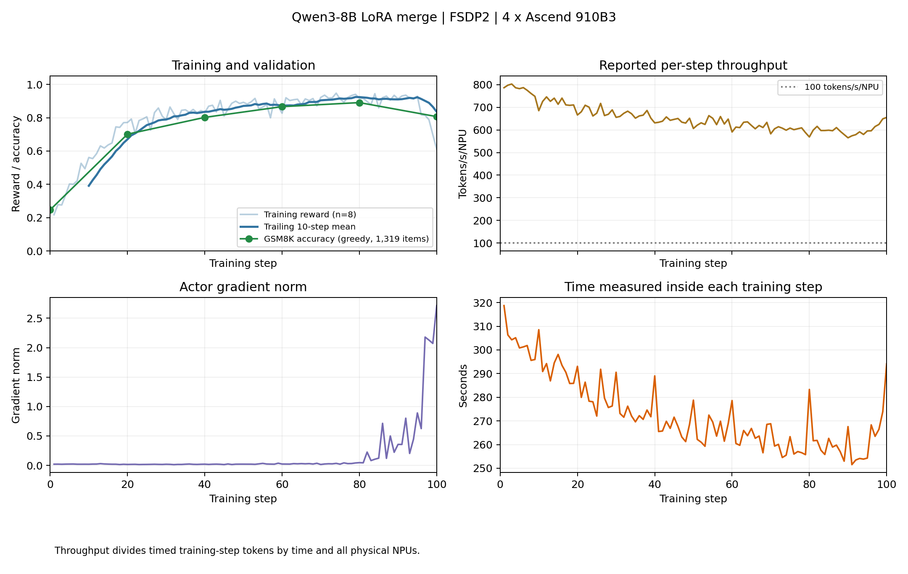

# Qwen3-8B LoRA merge 的昇腾适配与100步验证

固定配置满足 [issue #78](https://github.com/verl-project/verl-ascend-recipe/issues/78) 在无 GPU 基准时的训练要求：

- 训练长度：单台四张910B3，连续100步。
- 首末十步平均奖励：0.39160 → 0.83555。
- 每卡训练吞吐量：655.51 tokens/s，高于100 tokens/s。

第80步后验证准确率下降，原因尚未确定。本次结果不能证明其他配置或随机种子同样稳定。

## 配置与方法

本实验检验固定依赖和补丁能否支持 Qwen3-8B 的 GRPO + LoRA merge 训练。
训练使用 FSDP2，推理使用 vLLM-Ascend，并设置 `model.lora.merge=True`。

| 项目 | 配置 |
| --- | --- |
| 实测源码 | `84142b1`；完整提交号和哈希见 [provenance.json](evidence/910b3-100step/provenance.json) |
| 固定依赖 | 见 [REQUIRED_VERL.txt](REQUIRED_VERL.txt) |
| 硬件 | 4 × Ascend 910B3 |
| 系统软件 | CANN 9.0.0，驱动26.0.rc1；torch 2.9.0，torch_npu 2.9.0.post2 |
| 模型 | Qwen3-8B |
| 数据 | GSM8K：训练7473条，测试1319条；哈希见 [inputs.sha256](evidence/910b3-100step/inputs.sha256) |
| 批量大小 | 训练128，优化小批量64 |
| 采样 | 每条提示生成8个响应；提示和响应长度上限均为1024 token |
| 优化参数 | 学习率1e-5，KL 系数0.001 |
| LoRA | rank=32，alpha=64，目标模块 `all-linear`，开启权重合并 |
| 训练执行 | FSDP2，bf16，不卸载 actor |
| 推理执行 | 张量并行度2，eager 模式，`gpu_memory_utilization=0.6` |
| 训练长度 | 100步，epoch 上限100 |
| 保存与验证 | 每10步保存，每20步验证，训练前验证 |

算法和 LoRA 超参数沿用固定 verl 版本的
[`run_qwen3_8b_merge_fsdp.sh`](https://github.com/verl-project/verl/blob/bc72e38edba78e778bfbd462638f9634b9140a76/examples/tuning/lora/run_qwen3_8b_merge_fsdp.sh)。
适配调整包括：

- 设备与执行：使用四张 NPU，启用 eager 模式和分块熵计算，关闭 torch.compile。
- 训练控制：调整 epoch 上限、保存频率和验证频率，增加日志与步数检查。

历史配置只遍历一次数据，导致 `7473 // 128 = 58` 步后提前结束。当前脚本已修正这一问题。

实验在新检查点目录中运行，没有中断或跨主机续训。完整准备和运行命令见 [README](README.md)。
训练后保存 TaskRunner 原始日志、容器退出状态和检查点文件记录，再抽取完整指标行进行复算。
后续整理仅修改训练脚本注释，两份依赖补丁保持不变。

## 适配实现

### 权重合并

权重合并复用 verl 已有实现。
[`engine_workers.py`](https://github.com/verl-project/verl/blob/bc72e38edba78e778bfbd462638f9634b9140a76/verl/workers/engine_workers.py)
读取合并配置。FSDP2 在
[`transformer_impl.py`](https://github.com/verl-project/verl/blob/bc72e38edba78e778bfbd462638f9634b9140a76/verl/workers/engine/fsdp/transformer_impl.py)
的 `merged_lora_context` 中取得合并后的权重，退出上下文时恢复 LoRA 和基座模型状态。
[`vllm_async_server.py`](https://github.com/verl-project/verl/blob/bc72e38edba78e778bfbd462638f9634b9140a76/verl/workers/rollout/vllm_rollout/vllm_async_server.py)
在此模式下设置 `lora_rank=0`，使推理端接收完整模型权重。参考策略的对数概率由禁用 LoRA 的 actor 计算。

### 设备探测

设备探测补丁修复 `get_npu_versions()` 硬编码查询物理卡1的问题，改为从 `npu-smi info -m`
取得首个可见物理卡。原函数不读取 `ASCEND_VISIBLE_DEVICES`，因此设置该变量不能替代补丁。

### 采样器

采样器补丁回移上游 [PR #13394](https://github.com/vllm-project/vllm-ascend/pull/13394)
的张量生命周期修复，合入提交为 `fc0ce85b58f019e5a1988dbd3f39d014052fb44b`。
张量 `q` 在辅助执行流中创建，在当前执行流中使用。两个调用的作用不同：

- `wait_stream`：保证执行顺序。
- `q.record_stream(...)`：防止分配器在使用完成前重用张量内存。

历史对照使用同一设备，张量并行度为1：

| 版本 | 生成 token 数 | 越界 ID 数 | 对应的 `-inf` 数 |
| --- | --- | --- | --- |
| 原版 | 224621 | 4 | 4 |
| 补丁版 | 225828 | 0 | 0 |

该对照支持生命周期修复，但不能逐一解释原训练中的异常。
本次完整训练使用张量并行度2，未进行只改变补丁的训练对照。因此，不能将奖励或吞吐量变化归因于补丁。

## 实测结果

[metrics.log](evidence/910b3-100step/metrics.log)包含全部训练和验证指标行，
[summary.json](evidence/910b3-100step/summary.json)保存复算结果。

| 检查项 | 结果 |
| --- | --- |
| 训练步数 | 1–100步连续，无缺失或重复 |
| 已记录训练指标 | 全部有限，各步梯度范数非零 |
| 七项 `rollout_corr` 指标 | 每步均存在且有限 |
| 首末十步平均奖励 | 0.3916015625 → 0.835546875 |
| 每卡吞吐量 | 累计计算655.5106 tokens/s；最低单步565.1711 tokens/s |
| GSM8K 准确率 | 326/1319（24.72%）→ 1064/1319（80.67%） |
| 第100步检查点 | 模型、优化器分片和额外状态均存在 |
| 容器退出状态 | 退出码0，`OOMKilled=false` |

累计 token 数为71,621,758，训练步累计时间为27,315.25477820309秒。
每卡吞吐量按 `71621758 / 27315.25477820309 / 4` 计算，不是各步吞吐量的算术平均值，
也不包含全部启动、验证和保存时间。容器总运行时间约为8.04小时。

| 训练步 | 0 | 20 | 40 | 60 | 80 | 100 |
| --- | --- | --- | --- | --- | --- | --- |
| GSM8K 准确率 | 24.7157% | 70.1289% | 80.2123% | 86.6566% | 89.0826% | 80.6672% |

### 后期准确率下降

第100步验证准确率比第80步低8.42个百分点。最后五步的响应长度增加，奖励和梯度范数如下：

| 训练步 | 96 | 97 | 98 | 99 | 100 |
| --- | --- | --- | --- | --- | --- |
| 奖励 | 0.8174 | 0.8145 | 0.7881 | 0.6982 | 0.6113 |
| 梯度范数 | 0.6250 | 2.1797 | 2.1289 | 2.0723 | 2.7148 |

本次没有多随机种子实验，也没有学习率、KL 系数或梯度裁剪对照。后期下降的原因尚未确定。

## 结果的适用范围

- **硬件与配置**：只验证上述版本、四张910B3和100步训练；未验证 GPU 对比、八卡或 A3。
- **数值检查**：只覆盖日志中的指标，不能证明所有中间张量均正确。
- **检查点**：第100步只检查文件，未加载恢复训练；第80步也未单独加载评测。

日志中的 NPU 内存指标按 `1024**3` 换算，实际单位为 GiB。CPU 内存指标来自系统统计，
不等于 actor 进程的常驻内存或锁页内存；本次未采集锁页内存峰值。

复现按 [REQUIRED_VERL.txt](REQUIRED_VERL.txt) 核对软件版本、源码提交和补丁，不要求使用同一镜像。
本次使用的镜像信息保留在[原始记录](evidence/910b3-100step/image.json)中，仅用于追溯实验环境。
版本核对不代替训练验证；接收方仍按 README 执行训练并检查指标。
PR 合入和向 issue 提交实践文档尚未完成。
