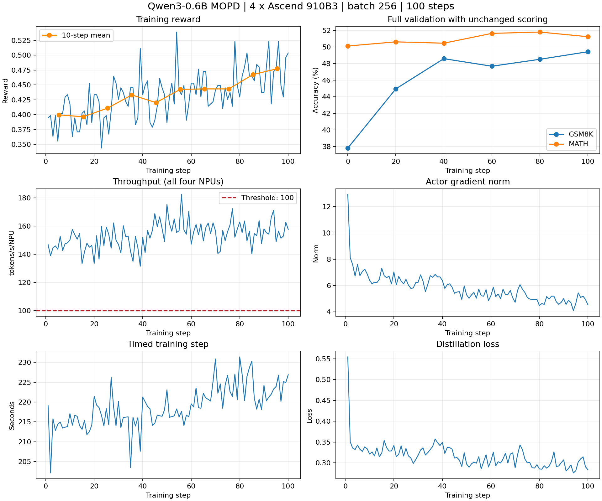

# Qwen3-0.6B 多教师 MOPD 的昇腾适配与 100 步验证

本实验检验：在指定学生和双教师、原评分及纯蒸馏损失下，使用非思考模板、明确 GSM8K 最终答案格式和 batch256，
能否在四张 910B3 上完成 100 步，并取得 reward 上升和每卡吞吐量大于 100 tokens/s。

实测结果支持该配置：首末十步平均 reward 为 0.39961 → 0.47734，每卡吞吐量为 153.49 tokens/s，
GSM8K 和 MATH 全量验证均高于同配置初始值。它满足 [issue #73](https://github.com/verl-project/verl-ascend-recipe/issues/73)
在无 GPU 基准时的训练要求。验证曲线有波动，不能据一次运行推断其他配置或随机种子同样稳定。

## 配置与方法

原默认配置完成 100 步后 reward 下降，因此先做生成长度、模板与教师对照，再选择当前配置。
最终训练从初始学生权重开始，训练前及每 20 步做全量验证。训练前后使用同样的提示、评分和生成设置，
避免将提示调整带来的初始分数变化算成训练收益。历史失败和对照详见[诊断记录](DIAGNOSTIC_EXPERIMENTS.md)。

| 项目 | 配置 |
| --- | --- |
| 实测 recipe。 | `22d70948c954311e109684228bb91c48e9031f0c`，运行文件哈希见 [provenance.json](results/2026-09-11-batch256/provenance.json)。 |
| 固定依赖。 | verl `bc72e38e`、vLLM `bcf2be96`、vLLM-Ascend `a43c8cc8`，完整版本见 [REQUIRED_VERL.txt](REQUIRED_VERL.txt)。 |
| 硬件与软件。 | 单台 4 × Ascend 910B3，CANN 9.0.0，驱动 26.0.rc1，torch 2.9.0、torch_npu 2.9.0.post2。 |
| 学生与教师。 | Qwen3-0.6B 学生占两卡；Qwen3-4B 和 Qwen3-8B 教师各占一卡。 |
| 后端。 | 学生使用 FSDP，在线生成和教师打分使用 vLLM-Ascend；各推理副本 TP=1。 |
| 数据。 | 训练 14966 条，验证 GSM8K 1319 条、MATH 4998 条。 |
| 输入。 | GSM8K 统一追加简短解答及 `#### <number>` 最终行说明，两源均使用非思考模板。 |
| 批量与更新。 | train batch=256，mini-batch=256，`ppo_epochs=1`，`rollout.n=1`，每步一次 mini-batch 更新。 |
| 长度与显存。 | prompt 上限 1024，response 上限 2048，训练动态 batch token 预算 24576。 |
| 优化与精度。 | 学习率 1e-6，训练参数和 AdamW 状态使用 BF16。 |
| 损失。 | k1，`use_policy_gradient=True`，`use_task_rewards=False`。 |
| 采样与验证。 | 训练温度 1，验证为 greedy；两者分别统计。 |
| 训练控制。 | 100 步，每 10 步保存，训练前及每 20 步验证，`resume_mode=auto`。 |

完整环境准备、数据处理、补丁应用和命令见 [README](README.md)。数据准备不读取答案，
问题、答案、行序和数据源保持不变，MATH 文件逐字节保留。源码提交和软件版本固定，镜像信息仅用于追溯实际环境。

## 适配实现

### 双教师路由和蒸馏损失

MOPD 复用固定 verl 版本的多教师能力。
[`agent_loop.py`](https://github.com/verl-project/verl/blob/bc72e38edba78e778bfbd462638f9634b9140a76/verl/experimental/agent_loop/agent_loop.py)
在学生生成后，把 prompt 与 response token ID 和 `data_source` 交给教师管理器。
GSM8K 路由到 Qwen3-4B，MATH 路由到 Qwen3-8B；每条样本使用一位教师。

教师对学生实际生成的序列计算 log-prob，不重新生成学生答案，也不重新套用模板。
当前 k1 路径请求 `prompt_logprobs=0` 和 `max_tokens=1`，只使用已采样 token 的概率，不使用配置中的 top-k 分布。
response 与教师输出按下一 token 位置对齐，进入损失前截取对应区间。

[`losses.py`](https://github.com/verl-project/verl/blob/bc72e38edba78e778bfbd462638f9634b9140a76/verl/trainer/distillation/losses.py)
计算学生与教师 log-prob 之差，将其裁剪到 [-10,10]，再取负值并 `detach()` 作为 policy loss 的优势。
`use_task_rewards=False` 使任务 reward 不参与损失，但仍按原 GSM8K/MATH 评分用于观测。
本次完整训练中，actor loss 与蒸馏 loss 的最大绝对差为 2.9802e-8。

两步功能实验保存了两位教师各 16 条真实响应，32 条均匹配到学生损失输入，逐 token k1 关系成立。
该实验使用另一份 910B1 环境和短响应配置，支持已检查的功能路径；完整精度和性能结论来自下文独立的 100 步运行。

### 设备探测与采样器

设备探测补丁将硬编码物理卡查询改为首个可见物理卡，适用于只映射部分设备的容器。
采样器补丁回移上游 [PR #13394](https://github.com/vllm-project/vllm-ascend/pull/13394)，
提交为 `fc0ce85b58f019e5a1988dbd3f39d014052fb44b`。
`wait_stream` 保证执行顺序，`q.record_stream(...)` 防止辅助 stream 创建的张量在消费者使用完成前被重用。

独立 TP=1 对照中，原版 224621 个 token 出现 4 个越界 ID 和对应的 `-inf`，
补丁组 225828 个 token 中两者均为 0。该结果支持生命周期修复，不能将本次 reward 收益单独归因于该补丁。

### 输入和批量调整

默认 100 步的首末十步 reward 从 0.33672 降至 0.25391。固定样本对照定位了答案格式失分和生成长度影响，
仅增加长度或仅关闭 thinking 都不够。指定教师对照支持明确格式与非思考模板；这没有更换模型、问题或评分。

该输入配置的 batch128 候选只完成 10 步，四卡吞吐为 77.71 tokens/s/NPU，保存 checkpoint 后主动停止。
后续把 train batch 与 mini-batch 同时增至 256，从初始权重独立运行，前一试验不计入本轮。
批量变化也改变梯度估计和样本数，不能把收益单独归因于某一个超参数。

## 实测结果

[完整训练日志](results/2026-09-11-batch256/training_log.txt)保留配置、初始化、100 步更新和最终验证，
[results.json](results/2026-09-11-batch256/results.json)保存全部十步窗口和六次验证。
日志只替换了两处内部 IP，101 个指标行逐字保持一致；规则和原始、发布文件哈希见
[log_sanitization.json](results/2026-09-11-batch256/log_sanitization.json)。

| 检查项 | 结果 |
| --- | --- |
| 训练长度。 | 1–100 步连续，无缺失、重复或跨试验拼接。 |
| 已记录训练指标。 | 全部有限，各步梯度范数非零。 |
| 首末十步 reward。 | 0.399609375 → 0.47734375，上升 0.077734375。 |
| 每卡吞吐量。 | 加权 153.494075 tokens/s，最低单步 131.480195。 |
| 最终验证。 | GSM8K 652/1319，MATH 2561/4998，均高于同配置初始值。 |
| checkpoint。 | 第 10 至 100 步每 10 步一个，共 10 个，最终文件哈希及归档目录已检查。 |
| 作业终态。 | 正常退出，ExitCode=0，OOMKilled=false，RestartCount=0。 |

累计 token 数为 13434084，训练步累计时间为 21880.460205 秒。
吞吐量按 `13434084 / 21880.460205 / 4` 计算，分母包含学生和教师，token 数包含 prompt 和 response。
该统计不等于单步吞吐量的算术平均或纯生成速度，也不包含整个作业的全部启动和验证时间。
作业从 2026-09-11 13:38:17 UTC 运行至 21:11:53 UTC，墙钟历时 7 小时 33 分 37 秒。

| 验证步 | GSM8K | MATH |
| --- | ---: | ---: |
| 0 | 499/1319，37.8317% | 2505/4998，50.1200% |
| 20 | 593/1319，44.9583% | 2530/4998，50.6202% |
| 40 | 641/1319，48.5974% | 2522/4998，50.4602% |
| 60 | 629/1319，47.6876% | 2581/4998，51.6407% |
| 80 | 640/1319，48.5216% | 2589/4998，51.8007% |
| 100 | 652/1319，49.4314% | 2561/4998，51.2405% |

最终 GSM8K 提高 11.5997 个百分点，MATH 提高 1.1204 个百分点。
MATH 第 100 步比第 80 步下降 0.5602 个百分点，两条曲线都不单调。这里保留预先约定的首末十步比较，
没有在观察结果后改用最好 checkpoint；单条轨迹也不足以断言统计显著性。

## 结果的适用范围

- 本结果绑定指定模型、输入、损失、四张 910B3 及固定软件版本，没有 GPU 基准、八卡或其他模型组合的验证结果。
- 参数精度检查发现 BF16 小更新舍入风险，但未建立它与原始 reward 下降的因果关系；实际参数存在更新，本次完整训练也取得收益。
- 数值检查覆盖日志中的指标，不证明全部中间张量。格式与长度对照解释已检查的失分机制，不证明全量退化只有一个原因。
- 本次未中断，checkpoint 只检查文件和归档目录，没有实际恢复优化器或数据加载器后继续训练。

## 复现与代码核对

接收方按 [README](README.md) 准备固定软件、三个模型和两套数据。交付脚本的默认训练参数已经对齐
本次通过的 batch256、非思考模板和 k1 纯蒸馏配置；覆盖这些参数属于不同实验。

实测运行通过环境变量和 Hydra 参数选择 batch256 与非思考模板；交付脚本把相同取值设为默认值，
没有改变损失、数据变换或补丁实现。实际运行文件身份保留在[运行信息](results/2026-09-11-batch256/provenance.json)，
交付后的等价性与离线检查见[交付检查](results/2026-09-11-batch256/delivery_checks.json)。
数据准备清单记录的是实测工具哈希，交付工具把可被 Python 优化模式移除的断言改成了显式错误检查，数据变换不变。
离线复算和工具测试不需要 NPU；图表可由 `tools/plot_training.py` 从同一完整日志生成。
