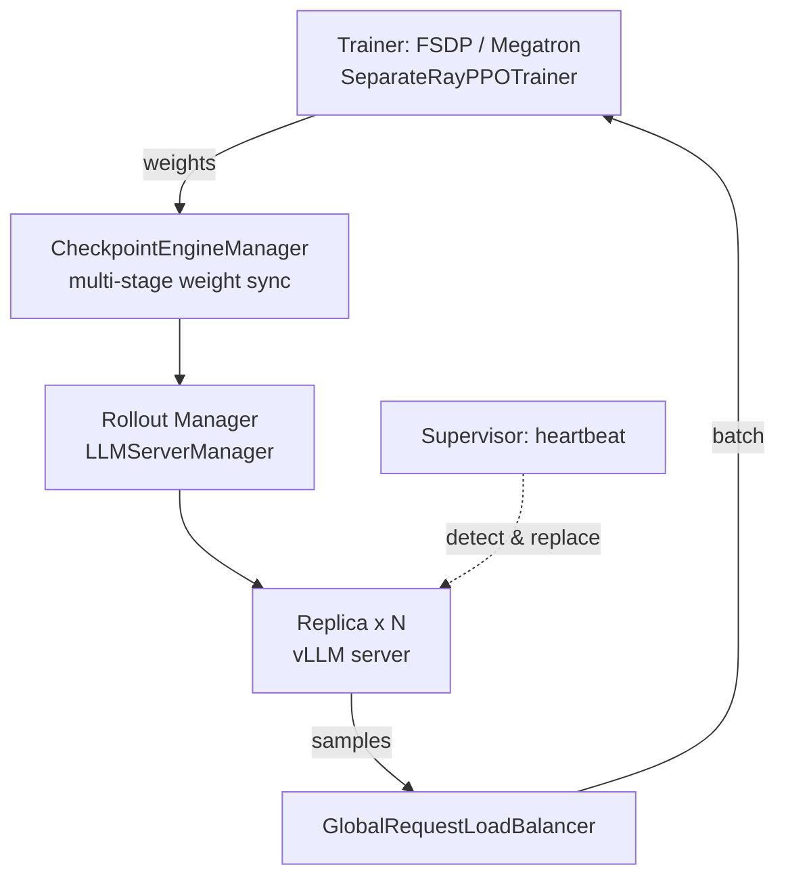
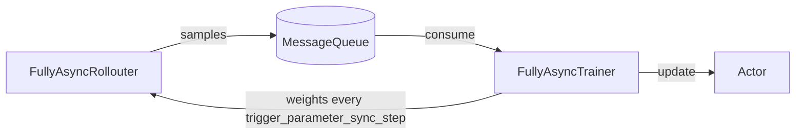
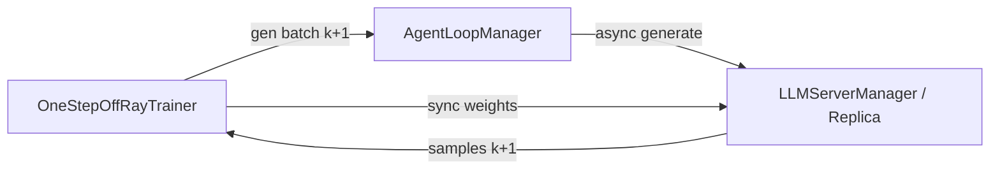
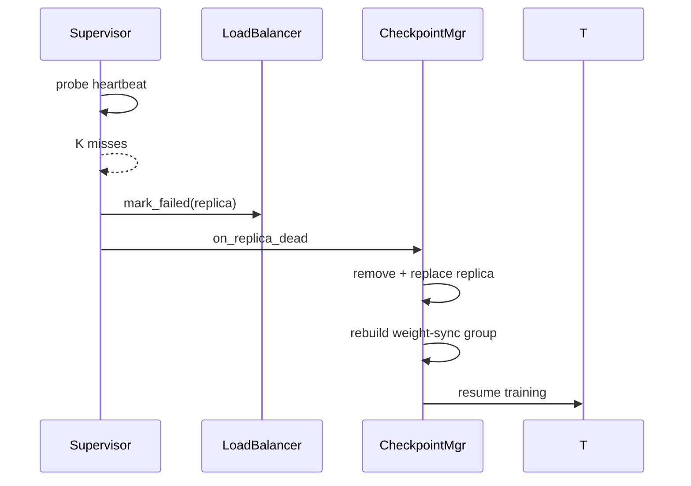

# Elastic Rollout: Summary Design

> Scope: `rollout_elastic` recipe. Reference: [RFC 4381 - Fault Management Module for Worker Group Recovery in Training-Inference Separation Systems](https://github.com/verl-project/verl/discussions/4381).

## Motivation

Long-horizon RL post-training makes generation the main bottleneck. In a train-inference separation architecture, rollout runs on a dedicated, standalone tier so it can scale and recover independently of training. This module makes that tier **elastic**: replicas can be added or removed, weights are re-synced from the trainer, and failed replicas are replaced without stopping the job. Two execution paths are provided: **fully-async** and **one-step-off**.

## Design Overview

Use case:

| config | value |
|-----|-----|
| algorithm.adv_estimator | ppo / grpo |
| actor_rollout_ref.actor.strategy | fsdp / megatron |
| actor_rollout_ref.rollout.name | vllm |
| actor_rollout_ref.rollout.mode | async (standalone) |
| actor_rollout_ref.rollout.checkpoint_engine.backend | nccl / hccl |

Overall architecture:

Both paths share this separation core and differ only in how generation is driven relative to training steps.

## Path A: Fully-Async Policy

Generation is fully decoupled from training. `FullyAsyncRollouter` samples continuously and pushes results into a `MessageQueue`; `FullyAsyncTrainer` consumes `require_batches` mini-batches per parameter sync.

Key knobs: `staleness_threshold` (pause generation when queued data is too stale), `trigger_parameter_sync_step` (weight-sync frequency), `require_batches`, and `partial_rollout` (resume interrupted generation after sync). Requires `data.train_batch_size=0` and `data.gen_batch_size=1`.

## Path B: One-Step-Off Policy

While training iteration k, the samples for iteration k+1 are generated. `OneStepOffRayTrainer` drives an `AgentLoopManager` over the LLM server; the next batch is dispatched as soon as the previous one is submitted, so generation overlaps training.

## Shared Infrastructure

- **Checkpoint engine** (`checkpoint_engine/`): transfers weights from trainer to rollout replicas over NCCL/HCCL. In FT mode each sync is a multi-stage transaction - `abort_requests → sleep → prepare → init_process_group → transfer → finalize → verify_version → wake_up → resume` - with bounded waits and retries.
- **Rollout replica & LB** (`workers/rollout/`): `RolloutReplica` (standalone mode), `LLMServerManager`/`LLMServerClient`, and `GlobalRequestLoadBalancer` route requests and isolate failed servers.
- **Fault tolerance** (`workers/rollout/fault_tolerance/`): `Supervisor` heartbeats replicas; K consecutive misses mark a replica dead, prune it from membership, and trigger replacement.

### Token Continuation

`progress/` persists per-request rollout state so a partial generation resumes after a fault instead of restarting from the prompt. A `RolloutProgressStoreActor` flushes cumulative token ids / log probs to disk every `flush_token_interval` tokens; before each attempt, `create_or_resume` loads the latest checkpoint and replays only the missing tail. `model_version_policy` (`exact` / `relaxed` / `compatible`) gates resumption against the model weight version, so a resume never mixes weights from different versions.

### Inference Scaling

Standalone replicas can be scaled out/in and replaced at runtime. `LLMServerManager` launches / tears down replicas; `CheckpointEngineManager.add_replicas / remove_replicas` update sync membership and rebuild the NCCL process group. New replicas enter as *pending*, get weight-synced at the next sync, then are promoted and admitted to the `GlobalRequestLoadBalancer`. On fault, `Supervisor` calls `spawn_replacement` and wires the fresh replica back into the LB / CKE.

## Fault Recovery Workflow

## Status

- [x] fully-async policy (FSDP / Megatron)
- [x] one-step-off policy (FSDP / Megatron)
- [x] elastic fault recovery (supervisor + weight-sync retry + token continuation)
- [ ] sglang / trtllm rollout validation
