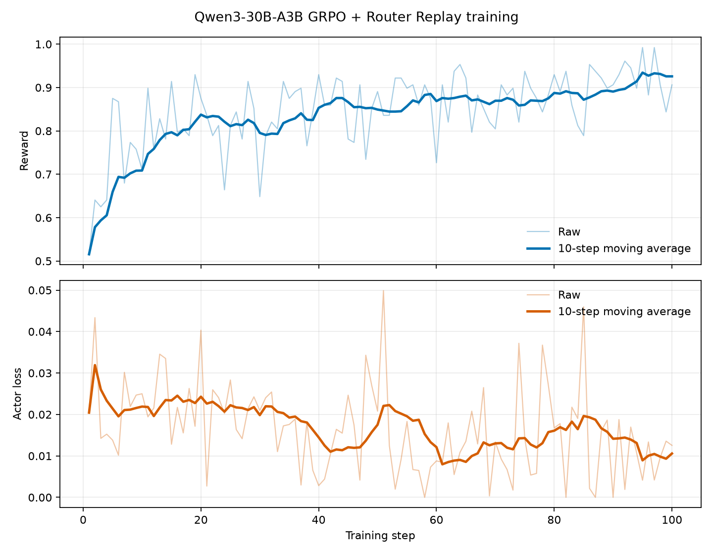

# Qwen3-30B-A3B Router Replay (R3) on Ascend

对应任务：[verl-ascend-recipe #25](https://github.com/verl-project/verl-ascend-recipe/issues/25)

## Required `verl` version

版本快照与安装命令见 [`REQUIRED_VERL.txt`](REQUIRED_VERL.txt)。依赖版本按该 revision 的官方 Ascend 环境要求配置。

## 1. 交付概览

本 recipe 提供 Qwen3-30B-A3B 的 GRPO + Rollout Router Replay（R3）Ascend 训练入口。训练侧使用 Megatron actor/reference 与 MindSpeed，rollout 侧使用 vLLM-Ascend，统一入口为 `verl.trainer.main_ppo`。

| 项目 | 配置 |
| --- | --- |
| 模型 | Qwen/Qwen3-30B-A3B |
| 数据集 | GSM8K parquet |
| 算法 | GRPO + R3 |
| 训练后端 | Megatron actor/reference + MindSpeed |
| Rollout 后端 | vLLM-Ascend |
| 验证平台 | Atlas 800T A2，4 x Ascend 910B |
| 训练规模 | 100 global steps |
| 运行脚本 | `router_replay/run_qwen3_30b_a3b_megatron_npu.sh` |

## 2. 适配方案

R3 通过以下配置启用：

```text
algorithm.adv_estimator=grpo
actor_rollout_ref.actor.model_engine=megatron
actor_rollout_ref.actor.megatron.router_replay.mode=R3
+actor_rollout_ref.actor.megatron.override_transformer_config.use_distributed_optimizer=True
actor_rollout_ref.rollout.enable_rollout_routing_replay=True
```

vLLM-Ascend 在 rollout 阶段返回 routed experts，verl 将路由结果随训练批次传递给 Megatron actor，并在 actor 更新阶段通过已有 Router Replay 实现执行 R3 回放。GRPO 继续使用 verl 的统一 advantage 与 policy-loss 调用链。

```text
GSM8K prompts
      |
      v
vLLM-Ascend TP4 rollout + routed expert capture
      |
      v
reward + GRPO advantage
      |
      v
Megatron PP4 actor R3 routed expert replay
      |
      v
optimizer update
      |
      v
bucketed actor-to-rollout weight synchronization
```

### 2.1 关键训练配置

| 配置项 | 值 |
| --- | ---: |
| train batch size | 32 |
| PPO mini batch size | 32 |
| micro batch size per NPU | 2 |
| rollout responses per prompt | 4 |
| prompt / response length | 512 / 1024 |
| actor learning rate | `1e-5` |
| actor TP / PP / EP / ETP | 1 / 4 / 1 / 1 |
| rollout TP | 4 |
| optimizer CPU offload fraction | 0.40 |
| weight synchronization bucket | 2048 MiB |
| vLLM max batched tokens / sequences | 8192 / 32 |
| graph mode | `FULL_DECODE_ONLY` |
| graph capture sizes | 1, 2, 4, 8, 16, 32 |
| training steps | 100 |

## 3. 环境与数据准备

### 3.1 依赖

| 组件 | 要求 |
| --- | --- |
| verl | 使用 [`REQUIRED_VERL.txt`](REQUIRED_VERL.txt) 记录的 revision |
| vLLM / vLLM-Ascend | 使用配套 release，vLLM >= 0.22.0 |
| Megatron Core / MindSpeed | 使用该 verl revision 官方支持的组合 |
| Ascend runtime | 使用上述软件栈支持的 CANN 与 torch-npu |

运行前应保证容器 `/dev/shm` 可容纳 `UPDATE_WEIGHTS_BUCKET_MEGABYTES` 指定的 weight-transfer bucket；默认值为 2048 MiB。

### 3.2 模型与数据

准备 `Qwen/Qwen3-30B-A3B` 权重，并在 verl 根目录生成 GSM8K parquet：

```bash
python3 examples/data_preprocess/gsm8k.py \
  --local_save_dir /path/to/data/gsm8k
```

数据目录应包含：

```text
/path/to/data/gsm8k/train.parquet
/path/to/data/gsm8k/test.parquet
```

## 4. 运行、日志与恢复

安装 `REQUIRED_VERL.txt` 记录的 verl revision：

```bash
./install_verl.sh --recipe router_replay --method git --dest /path/to/verl --yes
```

启动 4 NPU、100-step 训练：

```bash
MODEL_PATH=/path/to/Qwen3-30B-A3B \
TRAIN_FILE=/path/to/data/gsm8k/train.parquet \
VAL_FILE=/path/to/data/gsm8k/test.parquet \
MEGATRON_LM_PATH=/path/to/Megatron-LM \
NDEVICES_PER_NODE=4 \
TOTAL_TRAINING_STEPS=100 \
bash /path/to/verl-ascend-recipe/router_replay/run_qwen3_30b_a3b_megatron_npu.sh
```

脚本默认将 console 日志写入 `$PWD/logs/qwen3_30b_a3b_r3_megatron_vllm_ascend_<timestamp>.log`，额外参数会继续作为 Hydra overrides 传给 `verl.trainer.main_ppo`。

默认不周期保存 checkpoint。需要保存与续训时设置：

```bash
SAVE_FREQ=100 \
CHECKPOINT_DIR=/path/to/checkpoints/qwen3_30b_a3b_r3 \
RESUME_MODE=auto \
bash /path/to/verl-ascend-recipe/router_replay/run_qwen3_30b_a3b_megatron_npu.sh
```

## 5. 100-step 长跑结果

本次训练在 Atlas 800T A2 的 4 x Ascend 910B 上连续完成 100/100 global steps，进程以 exit code 0 正常结束。

| 指标 | 结果 |
| --- | ---: |
| 连续训练步数 | 100 / 100 |
| 训练耗时 | 09:31:21 |
| reward 首 10 步均值 | 0.708594 |
| reward 末 10 步均值 | 0.925781 |
| reward 首尾窗口增量 | +0.217188 |
| reward 线性斜率 | +0.001722 / step |
| actor loss 首 10 步均值 | 0.021904 |
| actor loss 末 10 步均值 | 0.010578 |
| actor loss 全程均值 | 0.016397 |
| generation throughput | 882.78 tokens/s（4 NPU），220.69 tokens/s/NPU |
| end-to-end throughput | 254.29 tokens/s（4 NPU），63.57 tokens/s/NPU |
| 平均 step 时间 | 342.81 s |
| actor 峰值 allocated / reserved HBM | 43.53 / 46.68 GiB/NPU |

generation throughput 按非 aborted response token 数除以生成阶段耗时计算；end-to-end throughput 使用 `perf/throughput`，覆盖完整训练 step。

### 5.1 长跑曲线

下图覆盖完整 100 steps，上图为 `critic/score/mean` reward，下图为 `actor/loss`。两项指标均展示原始值和 10-step moving average。



## 6. 复现证据与验收结论

100-step 训练指标日志：
[Qwen3-30B-A3B R3 training metric log](https://gist.githubusercontent.com/RordChang/77115831f2b245d33edbe22648fe9212/raw/training_100step.log)

| Issue #25 验收项 | 本次结果 |
| --- | --- |
| 完成 100 steps 或运行 12 小时 | 完成连续 100/100 steps |
| reward 上升 | 首 10 步均值 0.708594，末 10 步均值 0.925781 |
| 无 GPU 标杆时 TPS > 100 | 4 NPU end-to-end throughput 254.29 tokens/s |
| 提供算法适配调优文档 | 本文包含适配设计、环境、数据、命令、checkpoint/resume、指标和曲线 |

本次结果覆盖 Issue #25 的长跑、reward、性能和实践文档验收项，并提供 Qwen3-30B-A3B 在 Megatron + vLLM-Ascend 组合上的完整复现入口。
