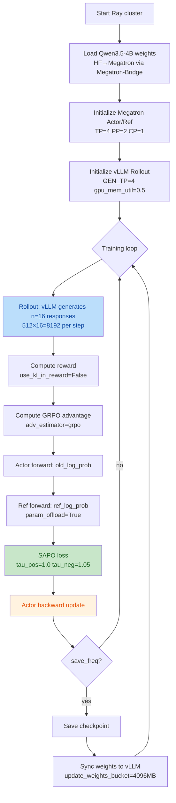
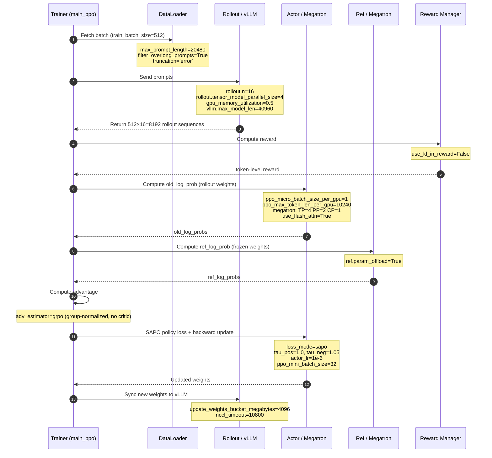

# Recipe: Smooth Advantage PO (SAPO)

## Required `verl` version

See [`REQUIRED_VERL.txt`](REQUIRED_VERL.txt) for the upstream repository, install mode, and copy-pastable `pip` / `git` instructions.

📝 **Paper@arXiv**: [SAPO: Smooth Advantage PO](https://arxiv.org/abs/2511.20347)

> SAPO replaces ratio clipping with a smooth tau-parameterized surrogate. Through asymmetric gating (`tau_pos` / `tau_neg`), it applies different degrees of regularization to positive and negative advantages, mitigating entropy collapse and improving training stability in long-CoT RL scenarios.

## Quickstart

1. Prepare the datasets:

```bash
# Download DAPO-Math-17k training dataset
git clone https://huggingface.co/datasets/BytedTsinghua-SIA/DAPO-Math-17k \
    $HOME/verl/datasets/dapo-math-17k

# Download AIME 2024 test dataset
git clone https://huggingface.co/datasets/Maxwell-Jia/AIME_2024 \
    $HOME/verl/datasets/aime-2024
```

2. Download model weights:

```bash
hf download Qwen/Qwen3.5-4B --local-dir $HOME/verl/models/Qwen3.5-4B
```

3. Start Ray cluster and launch training:

```bash
# Head node
ray start --head --port 6766 --resources='{"NPU": 16}'
ray status

# Worker nodes (remaining 7 nodes for 8-node config)
ray start --address=<head_ip>:6766 --resources='{"NPU": 16}'

# Launch SAPO training
bash sapo/run_qwen3_5_4b_megatron_npu.sh
```

Override defaults via env vars:

```bash
MODEL_PATH=/path/to/Qwen3.5-4B \
TRAIN_FILE=/path/to/train.parquet \
VAL_FILE=/path/to/val.parquet \
TP=4 PP=2 \
bash sapo/run_qwen3_5_4b_megatron_npu.sh
```

## Scripts

| Script | Model | Backend | Algorithm | Hardware |
|---|---|---|---|---|
| `run_qwen3_5_4b_megatron_npu.sh` | Qwen3.5-4B (dense, GDN) | Megatron + vLLM | SAPO | 8 nodes × 16 NPUs (Atlas 800T A3) |

## Algorithm Configuration

```bash
# Core algorithm
algorithm.adv_estimator=grpo                  # GRPO advantage estimation
algorithm.use_kl_in_reward=False             # No KL penalty in reward

# SAPO policy loss
actor_rollout_ref.actor.policy_loss.loss_mode=sapo
+actor_rollout_ref.actor.policy_loss.tau_pos=1.0   # Positive advantage gate
+actor_rollout_ref.actor.policy_loss.tau_neg=1.05  # Negative advantage gate (slightly larger, more conservative)

# KL config (SAPO does not use KL loss)
actor_rollout_ref.actor.use_kl_loss=False
actor_rollout_ref.actor.entropy_coeff=0
```

Entry point: `verl.trainer.main_ppo` with `model_engine=megatron`.

## Qwen3.5 Architecture Constraint (Critical)

Qwen3.5 uses **Gated Delta Net (GDN)** linear attention, which currently does **NOT** support packed sequences (THD format) in Megatron-LM. The following three options must all be `False` to force **bshd** compute format:

- `model.use_remove_padding=False` — disables padding removal at model level
- `actor.megatron.use_remove_padding=False` — disables padding removal on Megatron actor side
- `actor.use_dynamic_bsz=False` — required for bshd mode

> Once Megatron-LM adds THD support for Qwen3.5 GDN, `use_remove_padding` can be set to `True` for better performance.

## Environment

### Software versions

| software | version |
|---|---|
| Python | 3.11 |
| CANN | ==9.0.0.B160 (CANN900B160) |
| torch | ==2.9.0 |
| torch_npu | ==2.9.0 |
| triton_ascend | ==3.2.1 |
| verl | main |
| vllm | v0.18.0 |
| vllm-ascend | v0.18.0 |
| transformers | 5.3.0 |
| Megatron-LM | 0.16.1 |
| MindSpeed | 0.16.0 |
| Megatron-Bridge | `de93536e` |

### Megatron-Bridge installation

> **Important**: The Docker image ships the deprecated `mbridge` (ISEEKYAN/mbridge, does not support Qwen3.5). You must manually install the official `Megatron-Bridge` (NVIDIA-NeMo/Megatron-Bridge, supports Qwen3.5). Both have the same import name `megatron_bridge`, making them easy to confuse.

```bash
# 1. Uninstall old version (avoid residual conflicts — same import name)
pip uninstall -y megatron-bridge megatron_bridge mbridge || true

# 2. Clone official repo and checkout the required commit
git clone https://github.com/NVIDIA-NeMo/Megatron-Bridge.git /opt/megatron-bridge
cd /opt/megatron-bridge
git checkout de93536e

# 3. Install in development mode
pip install -e .

# 4. Verify
python -c "import megatron_bridge; print(megatron_bridge.__version__)"
```

**Three ways verl integrates Megatron-Core:**

| Method | Status | Config |
|---|---|---|
| #1 verl built-in per-model conversion | Deprecated | `use_mbridge=False` (removed after v0.7) |
| #2 mbridge (ISEEKYAN/mbridge) | Will be deprecated in v0.8, no new models accepted | `use_mbridge=True, vanilla_mbridge=True` |
| #3 Megatron-Bridge (NVIDIA-NeMo official) | **Recommended**, supports Qwen3.5 | `use_mbridge=True, vanilla_mbridge=False` |

This script uses method #3: `use_mbridge=True, vanilla_mbridge=False`.

### Additional dependencies

```bash
pip install viztracer flash-linear-attention nvidia-modelopt nvidia-ml-py nvidia-resiliency-ext megatron-energon
```

- `flash-linear-attention` — Gated Delta Net (GDN) linear attention implementation, required for Qwen3.5.
- `megatron-energon` — Megatron data loader.
- `viztracer` — Performance tracing tool.

## Hardware and Parallelism

Default NPU configuration (8 nodes, 128 NPUs total), overridable via env vars:

| model | nnodes | devices per node | TP | PP | CP | EP | ETP | GEN_TP | DP |
|---|---|---|---|---|---|---|---|---|---|
| Qwen3.5-4B | 8 | 16 | 4 | 2 | 1 | 1 | 1 | 4 | 16 |

- **DP calculation**: `NNODES × NGPUS_PER_NODE / (TP × PP × CP) = 8 × 16 / (4×2×1) = 16`
- **Constraint**: `train_batch_size >= DP` (at least 1 sample per DP rank), script uses `train_batch_size=512`
- **GEN_TP=4**: vLLM rollout tensor parallelism, 4 NPUs per group, shares memory with Megatron (`gpu_memory_utilization=0.5`)

Single-node example (1 node, 8 NPUs):

| model | nnodes | devices per node | TP | PP | CP | EP | ETP | GEN_TP | DP |
|---|---|---|---|---|---|---|---|---|---|
| Qwen3.5-4B | 1 | 8 | 4 | 2 | 1 | 1 | 1 | 8 | 1 |

## Key Training Parameters

| Parameter | Value | Description |
|---|---|---|
| `train_batch_size` | 512 | Prompts per step |
| `rollout.n` | 16 | Samples per prompt (GRPO group size) |
| `ppo_mini_batch_size` | 32 | Mini-batch size |
| `max_prompt_length` | 20480 | Prompt length limit |
| `max_response_length` | 20480 | Response length limit |
| `vllm.max_model_len` | 40960 | vLLM max sequence length |
| `actor_lr` | 1e-6 | Actor learning rate |
| `tau_pos` / `tau_neg` | 1.0 / 1.05 | SAPO asymmetric gating params |
| `entropy_coeff` | 0 | Entropy regularization |
| `use_kl_loss` | False | No KL in loss |
| `use_kl_in_reward` | False | No KL in reward |
| `adv_estimator` | grpo | Group-normalized advantage, no critic |
| `loss_mode` | sapo | SAPO policy loss |
| `total_epochs` | 32 | Total epochs |
| `save_freq` | 5 | Save checkpoint every 5 steps |
| `test_freq` | 1000 | Validate every 1000 steps |

**Offload and precision** (`ALL_OFFLOAD=True`):

| Parameter | Value |
|---|---|
| `param_offload` | True |
| `optimizer_offload` | True |
| `grad_offload` | True |
| `optimizer_offload_fraction` | 1 |
| `overlap_cpu_optimizer_d2h_h2d` | True |
| `use_precision_aware_optimizer` | True |
| `optimizer_cpu_offload` | True |
| `dtype` | bfloat16 |

**Transformer config overrides:**

| Parameter | Value |
|---|---|
| `attention_backend` | auto |
| `recompute_method` | uniform |
| `recompute_granularity` | full |
| `recompute_num_layers` | 1 |
| `use_flash_attn` | True |
| `use_naive_l2norm` | True |

> ⚠️ `use_naive_l2norm=True` uses naive L2 norm instead of RMSNorm, which has weaker numerical stability at 20480 sequence length. If training crashes (NaN weights), investigate this option.

## Training Flow



**Per-step data interaction sequence:**



## Troubleshooting

### Q1: Missing Megatron-Bridge

**Symptom**: Training fails with error "mbridge does not support Qwen3.5".

**Root cause**: The Docker image ships `mbridge` (ISEEKYAN/mbridge, deprecated, only supports Qwen3/Qwen3-MoE, **not Qwen3.5**), not `Megatron-Bridge` (NVIDIA-NeMo official, supports Qwen3.5). verl falls back to the deprecated mbridge when the official package is not found.

> Note: `mbridge` and `Megatron-Bridge` are **two different packages** — pip names `mbridge` vs `megatron-bridge`, both import as `megatron_bridge`, making them easy to confuse.

**Solution**: Install official Megatron-Bridge manually, see [Megatron-Bridge installation](#megatron-bridge-installation) above.

### Q2: mstx.range_end error

**Symptom**: Training continues but each worker repeatedly prints:

```
[ERROR] Call range_end failed. Exception: mstx.range_end() missing 1 required positional argument: 'range_id'
```

**Root cause**: MindSpeed patches `torch.cuda.nvtx.range_push/pop` with NVTX→MSTX redirects, but `range_pop()` (0 args) is redirected to `mstx.range_end(range_id)` (1 required arg), causing TypeError.

| Original API | Args | Patch target | Args | Compatible? |
|---|---|---|---|---|
| `nvtx.range_push(message)` | 1 required | `mstx.range_start(message, stream, domain)` | 1 required + 2 optional | ✅ |
| `nvtx.range_pop()` | **0** | `mstx.range_end(range_id, domain)` | **1 required** | ❌ |

**Solution**: Replace MindSpeed's two mstx patches with no-op wrappers:

> ⚠️ **Do not simply comment out the patches.** Without patches, `torch.cuda.nvtx.range_push/pop` falls back to torch's stub, which raises `RuntimeError: NVTX functions not installed` on non-CUDA builds.

```bash
# Find the file inside the container
REQUIREMENTS_FILE=$(python -c "import mindspeed.features_manager.megatron_basic.requirements_basic as m; print(m.__file__)")

# Replace with no-op
sed -i "s|pm.register_patch('torch.cuda.nvtx.range_push', torch_npu.npu.mstx.range_start)|pm.register_patch('torch.cuda.nvtx.range_push', lambda *a, **k: None)|" "$REQUIREMENTS_FILE"
sed -i "s|pm.register_patch('torch.cuda.nvtx.range_pop', torch_npu.npu.mstx.range_end)|pm.register_patch('torch.cuda.nvtx.range_pop', lambda *a, **k: None)|" "$REQUIREMENTS_FILE"

# Verify
grep -n "nvtx" "$REQUIREMENTS_FILE"
```

### Q3: Checkpoint global shape mismatch

**Symptom**: Training launch fails with:

```
megatron.core.dist_checkpointing.core.CheckpointingException: Global shape mismatch for
loaded (torch.Size([1119331272])) and expected ((3362257868,)) tensor for key
optimizer.distributed.dp_group_idx_7.gbuf_idx_0.dtype_(torch.bfloat16, torch.bfloat16)
.bucket_idx_0.exp_avg
```

**Root cause**: The checkpoint directory contains a stale checkpoint from a different model size or parallelism config. verl auto-resumes from `default_local_dir`, and the old optimizer state doesn't match the new model. `actor.checkpoint.strict=False` **cannot bypass** this — `_validate_global_shapes` raises before the `strict` check.

**Solution**: Remove or back up the old checkpoint directory before restarting:

```bash
# Option 1: Back up and remove old checkpoint
mv $HOME/verl/ckpts/verl_sapo_qwen3_5/qwen3_5_4b_vllm_sapo_megatron \
   $HOME/verl/ckpts/verl_sapo_qwen3_5/qwen3_5_4b_vllm_sapo_megatron.old

# Option 2: Use a fresh output directory
export CKPTS_DIR=$HOME/verl/ckpts/verl_sapo_qwen3_5/v2
bash sapo/run_qwen3_5_4b_megatron_npu.sh
```

**Prevention**: When changing `MODEL_PATH` (different model size) or parallelism config (TP/PP/CP), always update the checkpoint directory to avoid cross-config resume.

### Q4: Megatron→vLLM inference tokenizer error

**Symptom**: After training, loading the merged checkpoint with vLLM for inference fails:

```
ValueError: Tokenizer class TokenizersBackend does not exist or is not currently imported.
```

**Root cause**: **transformers major version incompatibility** (training 5.x → inference 4.x). verl's model merger saves the tokenizer via `tokenizer.save_pretrained()` inside the training image. transformers 5.x writes `"tokenizer_class": "TokenizersBackend"` (a new unified backend class in 5.x) into `tokenizer_config.json`. The inference image's transformers 4.57.x doesn't have `TokenizersBackend`, so vLLM's `AutoTokenizer.from_pretrained()` fails.

**Solution**: **Upgrade the inference image's transformers to 5.x**:

```bash
pip install transformers==5.3.0
```

**Prevention**: Training and inference should use the same transformers major version. If the training and inference images have different major versions, the saved tokenizer files need to be overwritten with the original model's tokenizer or have the `tokenizer_class` field fixed before inference.

## Notes

- The script auto-detects NPU environment via `torch_npu`.
- Qwen3.5 GDN does not use packed sequences, so `use_remove_padding=False` and `use_dynamic_bsz=False` are required.
- NPU branch sets `vanilla_mbridge=False`, `use_flash_attn=True`, `use_naive_l2norm=True` for Ascend compatibility.
