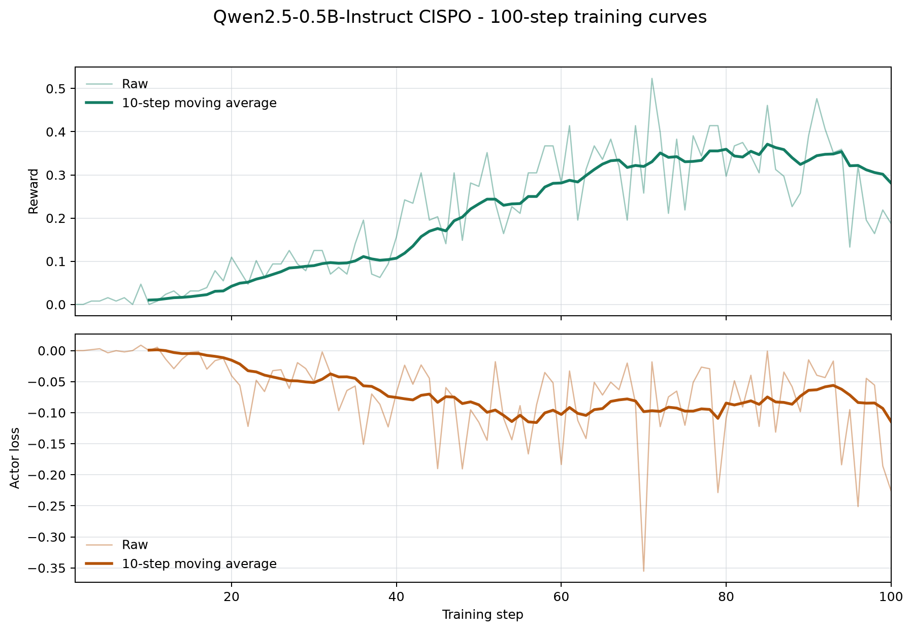

# Qwen2.5-0.5B-Instruct CISPO Ascend 整体交付报告

对应任务：[verl-ascend-recipe #17](https://github.com/verl-project/verl-ascend-recipe/issues/17)

## 1. 交付概览

本交付提供 Qwen2.5-0.5B-Instruct CISPO 在 Ascend NPU 上的可复现训练 recipe。训练侧
使用 Megatron 管理 actor 和 reference model，rollout 侧使用 vLLM-Ascend，训练入口为
`verl.trainer.main_ppo`。

| 项目 | 配置 |
| --- | --- |
| 模型 | Qwen2.5-0.5B-Instruct |
| 数据集 | GSM8K |
| 算法 | CISPO (`grpo` advantage + `cispo` policy loss) |
| 训练后端 | Megatron actor/reference |
| Rollout 后端 | vLLM-Ascend |
| 验证平台 | Atlas 800T A2，4 x Ascend 910B |
| 训练规模 | 100 global steps |
| 运行脚本 | `verl_ascend_practice/run_qwen2_5_0_5b_cispo_megatron_npu.sh` |

## 2. 适配方案

CISPO 通过以下配置启用：

```text
algorithm.adv_estimator=grpo
actor_rollout_ref.actor.policy_loss.loss_mode=cispo
actor_rollout_ref.actor.clip_ratio_low=10.0
actor_rollout_ref.actor.clip_ratio_high=0.2
actor_rollout_ref.actor.loss_agg_mode=token-mean
model_engine=megatron
```

recipe 通过 verl 的统一 policy-loss 调用链在 Megatron actor 中执行 CISPO objective，
并与 vLLM-Ascend rollout、GSM8K rule-based reward、权重同步和日志记录组成完整训练流程。

```text
GSM8K prompts
      |
      v
vLLM-Ascend TP2 rollout (2 replicas)
      |
      v
GSM8K exact-answer reward
      |
      v
GRPO group advantage
      |
      v
CISPO policy loss
      |
      v
Megatron TP2 actor update
      |
      v
weight synchronization
```

### 2.1 关键训练配置

| 配置项 | 值 |
| --- | ---: |
| train batch size | 32 |
| PPO mini batch size | 32 |
| micro batch size per NPU | 4 |
| rollout responses per prompt | 4 |
| prompt / response length | 512 / 512 |
| actor learning rate | `1e-6` |
| KL loss | `low_var_kl`, coefficient `0.001` |
| clip ratio low / high | 10.0 / 0.2 |
| actor TP / PP | 2 / 1 |
| rollout TP / replicas | 2 / 2 |
| rollout max sequences per replica | 64 |
| rollout max batched tokens | 8192 |
| rollout memory utilization | 0.50 |
| rollout mode | eager |
| weight synchronization bucket | 512 MB |
| precision | BF16 |

actor/reference 不启用 offload；actor 启用动态 token batch，rollout 启用 chunked prefill
和 prefix caching。模型、数据、batch、长度、并行度、checkpoint 和日志参数均可通过环境
变量覆盖。

## 3. 环境与数据准备

### 3.1 已验证软件环境

| 组件 | 版本 |
| --- | --- |
| CANN | 9.0 |
| Python | 3.11.15 |
| torch / torch-npu | 2.9.0 / 2.9.0.post2 |
| vLLM / vLLM-Ascend | 0.18.0 / 0.18.0 |
| Megatron Core / MindSpeed | 0.16.0 / 0.16.0 |
| MBridge | 0.15.1 |

### 3.2 数据准备

在 verl 根目录生成 GSM8K parquet：

```bash
export DATA_ROOT=/path/to/data

python3 examples/data_preprocess/gsm8k.py \
  --local_save_dir "${DATA_ROOT}/gsm8k"
```

数据目录应包含：

```text
/path/to/data/gsm8k/train.parquet
/path/to/data/gsm8k/test.parquet
```

## 4. 运行与恢复

在 verl 根目录执行：

```bash
MODEL_PATH=/path/to/Qwen2.5-0.5B-Instruct \
DATA_ROOT=/path/to/data \
NPUS_PER_NODE=4 \
TOTAL_TRAINING_STEPS=100 \
bash /path/to/verl-ascend-recipe/verl_ascend_practice/run_qwen2_5_0_5b_cispo_megatron_npu.sh
```

默认训练日志写入 `LOG_DIR`。需要周期性 checkpoint 时设置 `SAVE_FREQ`；使用相同的
`OUTPUT_DIR` 并保持 `RESUME_MODE=auto` 可恢复最新 checkpoint。额外参数会作为 Hydra
overrides 继续传递给 `verl.trainer.main_ppo`。

## 5. 100-step 长跑结果

本次训练在 Atlas 800T A2 的 4 x Ascend 910B 上连续完成 100/100 global steps，累计
step 时间为 1 小时 23 分 04.828 秒。每步 reward、actor loss、gradient norm、step time
和 throughput 均存在且为有限值。

| 指标 | 结果 |
| --- | ---: |
| 连续训练步数 | 100 / 100 |
| reward 首 10 步均值 | 0.010156 |
| reward 末 10 步均值 | 0.281250 |
| reward 首尾窗口增量 | +0.271094 |
| reward 线性斜率 | +0.00388862 / step |
| `actor/loss` 样本数 | 100 |
| `actor/loss` 首 10 步均值 | 0.000721 |
| `actor/loss` 末 10 步均值 | -0.114242 |
| 平均 step 时间 | 49.8483 s |
| 平均吞吐 | 258.8282 token/s/NPU |
| 4 NPU 实测总吞吐均值 | 1035.3128 token/s |

### 5.1 长跑曲线

下图覆盖完整 100 steps，依次展示 reward 和 CISPO actor loss。两项指标均保留原始值和
10-step moving average；reward 使用 `critic/score/mean`，loss 使用 `actor/loss`。



### 5.2 性能与稳定性

- reward 的末 10 步均值比首 10 步提高 0.271094。
- 4 NPU 实测总吞吐均值为 1035.3128 token/s，高于无 GPU 标杆时的 100 TPS 门槛。
- 训练连续完成 100 steps，所有必需训练指标均有 100 个有限值。

## 6. 复现证据与验收结论

完整训练日志：
[Qwen2.5-0.5B-Instruct CISPO 100-step training log](https://github.com/user-attachments/files/31128595/training_100step_sanitized.log)

| Issue #17 验收项 | 本次结果 |
| --- | --- |
| 完成 100 steps 或运行 12 小时 | 完成连续 100/100 steps |
| reward 上升 | 首 10 步均值 0.010156，末 10 步均值 0.281250 |
| 无 GPU 标杆时 TPS > 100 | 4 NPU 实测总吞吐均值 1035.3128 token/s |
| 提供可复现 recipe | 提供模型、数据、环境、启动、checkpoint/resume 和日志配置 |

本次结果覆盖 Issue #17 在无同版本 GPU 标杆时的效果和性能验收项，并提供了
Qwen2.5-0.5B-Instruct CISPO 在 Megatron + vLLM-Ascend 组合上的完整复现入口。
