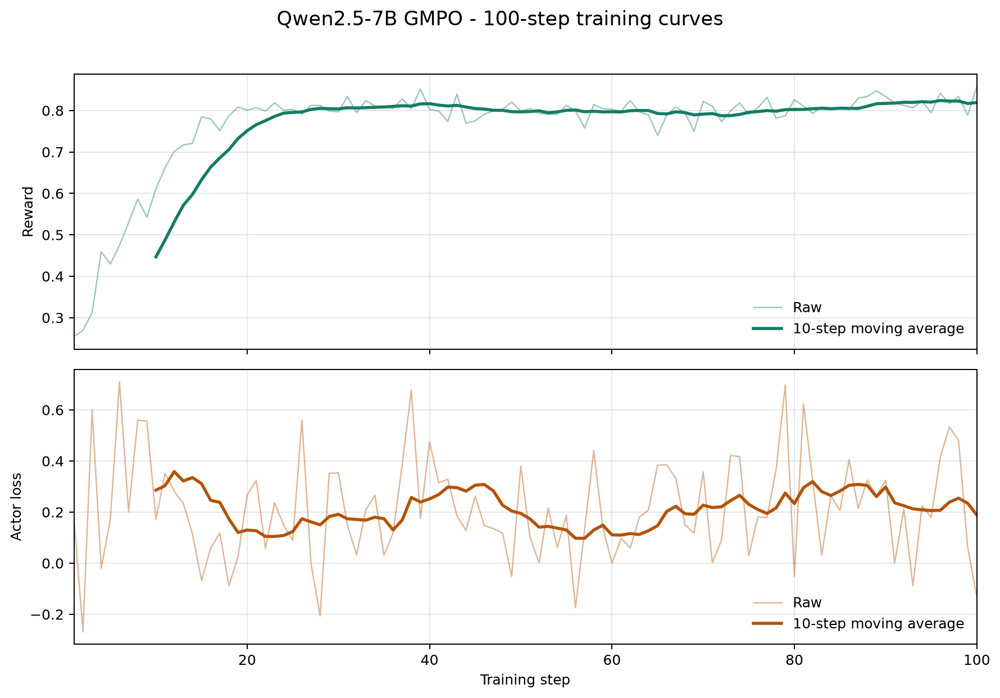

# Qwen2.5-7B GMPO Ascend 整体交付报告

对应任务：[verl-ascend-recipe #19](https://github.com/verl-project/verl-ascend-recipe/issues/19)

## 1. 交付概览

本交付提供 Qwen2.5-7B GMPO 在 Ascend NPU 上的可复现训练 recipe。训练侧使用 Megatron
管理 actor 和 reference model，rollout 侧使用 vLLM-Ascend，训练入口为
`verl.trainer.main_ppo`。

| 项目 | 配置 |
| --- | --- |
| 模型 | Qwen2.5-7B |
| 数据集 | GSM8K + MATH |
| 算法 | GMPO (`grpo` advantage + `geo_mean` policy loss) |
| 训练后端 | Megatron actor/reference |
| Rollout 后端 | vLLM-Ascend |
| 验证平台 | Atlas 800T A2，4 x Ascend 910B |
| 训练规模 | 100 global steps |
| 运行脚本 | `verl_ascend_practice/run_qwen2_5_7b_gmpo_megatron_npu.sh` |

## 2. 适配方案

GMPO 通过以下配置启用：

```text
algorithm.adv_estimator=grpo
actor_rollout_ref.actor.policy_loss.loss_mode=geo_mean
actor_rollout_ref.actor.clip_ratio_low=0.4
actor_rollout_ref.actor.clip_ratio_high=0.4
actor_rollout_ref.actor.loss_agg_mode=token-mean
model_engine=megatron
```

`geo_mean` policy loss 由 verl 统一注册并通过 actor 的 `ppo_loss` 调用。recipe 将该 loss
接入 Megatron actor/reference 与 vLLM-Ascend rollout 组合，并配置 Ascend 训练所需的并行、
offload、动态 batch、图模式、权重同步、checkpoint 和日志参数。

```text
GSM8K + MATH prompts
        |
        v
vLLM-Ascend TP1 rollout (4 replicas)
        |
        v
rule-based math reward
        |
        v
GRPO group advantage
        |
        v
GMPO geo_mean policy loss
        |
        v
Megatron TP4 actor update
        |
        v
weight synchronization and checkpoint
```

### 2.1 关键训练配置

| 配置项 | 值 |
| --- | ---: |
| train batch size | 256 |
| PPO mini batch size | 128 |
| micro batch size per NPU | 1 |
| rollout responses per prompt | 2 |
| prompt / response length | 512 / 1024 |
| actor learning rate | `1e-6` |
| KL loss | `low_var_kl`, coefficient `0.001` |
| actor TP / PP | 4 / 1 |
| rollout TP / replicas | 1 / 4 |
| rollout max sequences per replica | 128 |
| rollout max batched tokens | 8192 |
| rollout memory utilization | 0.55 |
| graph mode | `FULL_DECODE_ONLY` |
| weight synchronization bucket | 1152 MB |
| precision | BF16 |
| checkpoint interval | 10 steps |

actor 启用参数、梯度和 optimizer offload，reference 启用参数 offload；actor 同时启用完整
activation recompute 与动态 token batch。rollout prefill 使用动态图，decode 使用
vLLM-Ascend graph capture，capture sizes 为 2、4、8、16、32、64、128。

## 3. 环境与数据准备

### 3.1 已验证软件环境

| 组件 | 版本 |
| --- | --- |
| CANN | 9.0 |
| Python | 3.11.15 |
| torch / torch-npu | 2.9.0 / 2.9.0.post2 |
| vLLM / vLLM-Ascend | 0.18.0 / 0.18.0 |
| Megatron Core / MindSpeed | 0.16.0 / 0.16.0 |
| MBridge | 0.15.1 |

容器需要为权重同步 bucket 提供足够的 POSIX shared memory。默认
`WEIGHT_BUCKET_MB=1152`，因此 `/dev/shm` 的可用空间应高于该值。

### 3.2 数据准备

在 verl 根目录生成 GSM8K 和 MATH parquet：

```bash
export DATA_ROOT=/path/to/data

python3 examples/data_preprocess/gsm8k.py \
  --local_save_dir "${DATA_ROOT}/gsm8k"

python3 examples/data_preprocess/math_dataset.py \
  --local_save_dir "${DATA_ROOT}/math"
```

## 4. 运行与恢复

在 verl 根目录执行：

```bash
MODEL_PATH=/path/to/Qwen2.5-7B \
DATA_ROOT=/path/to/data \
NPUS_PER_NODE=4 \
TOTAL_TRAINING_STEPS=100 \
bash /path/to/verl-ascend-recipe/verl_ascend_practice/run_qwen2_5_7b_gmpo_megatron_npu.sh
```

模型、数据、设备数、并行度、batch、长度、checkpoint 和日志目录均可通过环境变量覆盖；
额外参数会作为 Hydra overrides 继续传递给 `verl.trainer.main_ppo`。

默认每 10 steps 保存一次 checkpoint。使用相同的 `OUTPUT_DIR` 重新启动时，
`trainer.resume_mode=auto` 会恢复最新 checkpoint。训练日志默认写入 `LOG_DIR`。

## 5. 100-step 长跑结果

本次训练在 Atlas 800T A2 的 4 x Ascend 910B 上连续完成 100/100 global steps。训练主循环
用时约 6 小时 44 分钟，100 个 step 的必需训练指标均存在且为有限值。

| 指标 | 结果 |
| --- | ---: |
| 连续训练步数 | 100 / 100 |
| reward/score 首 10 步均值 | 0.4469 |
| reward/score 末 10 步均值 | 0.8193 |
| reward/score 首尾窗口增量 | +0.3725 |
| reward/score 线性斜率 | +0.002302 / step |
| `actor/loss` 样本数 | 100 |
| `actor/loss` 首 10 步均值 | 0.2859 |
| `actor/loss` 末 10 步均值 | 0.1889 |
| 平均 step 时间 | 242.1354 s |
| 平均吞吐 | 238.7716 token/s/NPU |
| 4 NPU 实测总吞吐均值 | 955.0863 token/s |
| actor 峰值分配显存 | 14.1919 GiB/NPU |

### 5.1 长跑曲线

下图覆盖完整 100 steps，依次展示 reward/score 和 GMPO actor loss。两项指标均保留
原始值和 10-step moving average；reward/score 使用 `critic/score/mean`，loss 使用
`actor/loss`。



GMPO actor loss 是 policy optimization objective，训练过程中允许随 batch 和 advantage
分布波动。100 个 `actor/loss` 样本均为有限值；结合 reward 首尾窗口提升，可确认训练更新
持续生效。

### 5.2 性能与稳定性

- reward/score 的末 10 步均值比首 10 步提高 0.3725，整体趋势上升。
- 4 NPU 实测总吞吐均值为 955.0863 token/s，高于任务在无 GPU 标杆时要求的 100 TPS。
- 训练主循环连续完成 100 steps，并在 step 100 保存 checkpoint。
- `actor/loss`、`actor/grad_norm`、reward/score、step time 和 throughput 均记录了 100 个有限值。

## 6. 复现证据与验收结论

完整训练日志：
[Qwen2.5-7B GMPO 100-step training log](https://github.com/user-attachments/files/31117775/training_100step_sanitized.log)

| Issue #19 验收项 | 本次结果 |
| --- | --- |
| 完成 100 steps 或运行 12 小时 | 完成连续 100/100 steps |
| reward 上升 | 首 10 步均值 0.4469，末 10 步均值 0.8193 |
| 无 GPU 标杆时 TPS > 100 | 4 NPU 实测总吞吐均值 955.0863 token/s |
| 提供可复现 recipe | 提供模型、数据、环境、启动、checkpoint/resume 和日志配置 |

本次结果满足 Issue #19 在无同版本 GPU 标杆时的效果和性能验收标准，并提供了
Qwen2.5-7B GMPO 在 Megatron + vLLM-Ascend 组合上的完整复现入口。
