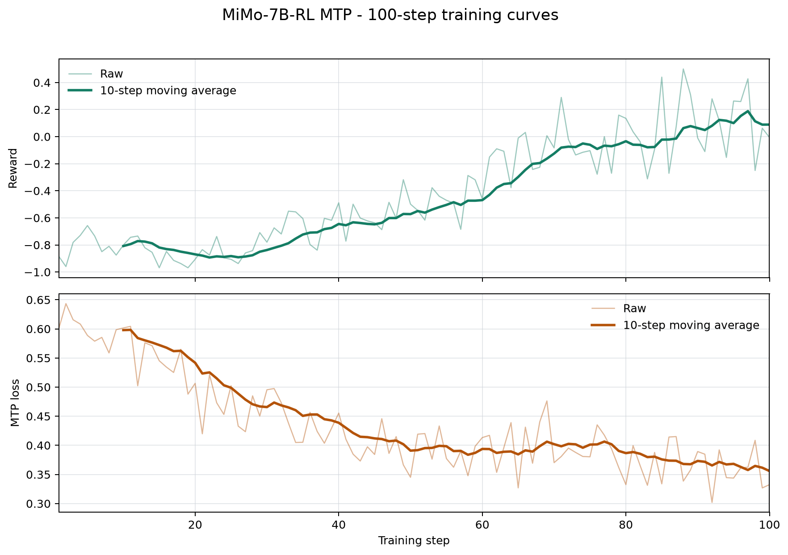

# MiMo-7B-RL MTP Ascend 整体交付报告

对应任务：[verl-ascend-recipe #20](https://github.com/verl-project/verl-ascend-recipe/issues/20)

## 1. 交付概览

本交付提供 MiMo-7B-RL MTP 在 Ascend NPU 上的可复现训练 recipe。训练侧使用 Megatron
与 MBridge 管理 actor 和 reference model，rollout 侧使用 SGLang-Ascend，训练入口为
`verl.trainer.main_ppo`。

| 项目 | 配置 |
| --- | --- |
| 模型 | XiaomiMiMo/MiMo-7B-RL |
| 数据集 | MATH parquet |
| 算法 | GRPO + MTP auxiliary loss |
| 训练后端 | Megatron actor/reference |
| Rollout 后端 | SGLang-Ascend |
| 验证平台 | Atlas 800T A2，4 x Ascend 910B |
| 训练规模 | 100 global steps |
| 运行脚本 | `verl_ascend_practice/run_mimo_7b_mtp_megatron_npu.sh` |
| 必要补丁 | `verl_ascend_practice/patches/mtp_checkpoint_engine_reoffload.patch` |

## 2. 适配方案

MTP 训练通过以下配置启用：

```text
actor_rollout_ref.model.mtp.enable=True
actor_rollout_ref.model.mtp.enable_train=True
actor_rollout_ref.model.mtp.enable_rollout=False
actor_rollout_ref.model.mtp.mtp_loss_scaling_factor=0.1
actor_rollout_ref.model.mtp.detach_encoder=True
actor_rollout_ref.rollout.name=sglang
actor_rollout_ref.rollout.checkpoint_engine.backend=nccl
model_engine=megatron
```

MiMo-7B-RL 的 MTP head 参与 Megatron actor 训练，rollout 仍使用主模型生成。SGLang 在生成
阶段计算 rollout log probability，`rollout_correction.bypass_mode` 将其复用为 PPO old-policy
log probability。权重更新复用 verl 通用 checkpoint engine；必要补丁在同步完成后恢复已启用
的 actor parameter offload。

```text
MATH prompts
      |
      v
SGLang-Ascend TP1 rollout (4 replicas)
      |
      v
math reward + GRPO advantage
      |
      v
PPO objective + MTP auxiliary loss
      |
      v
Megatron TP2 actor update
      |
      v
generic checkpoint-engine weight synchronization
      |
      v
actor parameter re-offload
```

### 2.1 关键训练配置

| 配置项 | 值 |
| --- | ---: |
| train / validation batch size | 16 / 16 |
| PPO mini batch size | 8 |
| micro batch size per NPU | 1 |
| rollout responses per prompt | 2 |
| prompt / response length | 512 / 1024 |
| actor learning rate | `1e-6` |
| actor TP / PP / CP | 2 / 1 / 1 |
| rollout TP / replicas | 1 / 4 |
| rollout max sequences per replica | 8 |
| rollout max batched tokens | 8192 |
| rollout memory utilization | 0.45 |
| graph max batch size | 8 |
| weight synchronization bucket | 1280 MB |
| MTP loss scaling factor | 0.1 |
| precision | BF16 |
| checkpoint interval | 100 steps |

actor 启用参数、梯度和 optimizer offload，并使用完整 activation recompute 与动态 token
batch。SGLang-Ascend 启用 graph mode、chunked prefill 和 prefix caching。

## 3. 环境与数据准备

### 3.1 已验证软件环境

| 组件 | 版本 |
| --- | --- |
| CANN | 9.0 |
| Python | 3.11.15 |
| torch / torch-npu | 2.8.0 / 2.8.0.post2 |
| SGLang / sgl-kernel-npu | 0.5.10 / 2026.2.1 |
| Megatron Core / MindSpeed | 0.16.0 / 0.16.0 |
| MBridge | 0.15.1 |
| Transformers | 5.3.0 |

### 3.2 模型与数据准备

下载 `XiaomiMiMo/MiMo-7B-RL`，并将模型 `config.json` 中的
`max_position_embeddings` 设置为 `32768`。

在 verl 根目录生成 MATH parquet：

```bash
python3 examples/data_preprocess/math_dataset.py \
  --local_save_dir /path/to/math
```

数据目录应包含：

```text
/path/to/math/train.parquet
/path/to/math/test.parquet
```

## 4. 运行与恢复

在 verl 根目录应用必要补丁并启动训练：

```bash
git apply /path/to/verl-ascend-recipe/verl_ascend_practice/patches/mtp_checkpoint_engine_reoffload.patch

DEVICE=npu \
MODEL_PATH=/path/to/MiMo-7B-RL \
DATA_ROOT=/path/to/math \
NPUS_PER_NODE=4 \
TOTAL_TRAINING_STEPS=100 \
bash /path/to/verl-ascend-recipe/verl_ascend_practice/run_mimo_7b_mtp_megatron_npu.sh
```

模型、数据、设备数、并行度、batch、长度、MTP loss scaling、checkpoint 和日志目录均可
通过环境变量覆盖；额外参数会作为 Hydra overrides 继续传递给 `verl.trainer.main_ppo`。

默认在 step 100 保存 checkpoint。使用相同的 `OUTPUT_DIR` 重新启动时，
`RESUME_MODE=auto` 会恢复最新 checkpoint。训练日志默认写入 `LOG_DIR`。

## 5. 100-step 长跑结果

本次训练在 Atlas 800T A2 的 4 x Ascend 910B 上连续完成 100/100 global steps，并完成
step 100 checkpoint。100 个 MTP loss 和 reward 样本均为有限值。

| 指标 | 结果 |
| --- | ---: |
| 连续训练步数 | 100 / 100 |
| reward 首 10 步均值 | -0.808044 |
| reward 末 10 步均值 | 0.089099 |
| reward 首尾窗口增量 | +0.897144 |
| MTP loss 首 10 步均值 | 0.597910 |
| MTP loss 末 10 步均值 | 0.355875 |
| MTP loss 首尾窗口变化 | -0.242035 |
| 4 NPU 端到端吞吐 | 533.286 token/s |
| 4 NPU 稳态吞吐 | 801.923 token/s |
| 稳态吞吐 | 200.481 token/s/NPU |
| actor 峰值分配 / reserved 显存 | 48.116 / 54.869 GiB/NPU |
| step 时间中位数 | 40.184 s |

端到端吞吐覆盖完整 100 steps 并包含 checkpoint 保存；稳态吞吐排除 step 1 和包含
`timing_s/save_checkpoint` 的 step。

### 5.1 长跑曲线

下图覆盖完整 100 steps，依次展示 reward 和 MTP loss。两项指标均保留原始值和 10-step
moving average；reward 使用 `critic/score/mean`，MTP loss 使用
`actor/mtp_losses/mtp_1_loss`。



### 5.2 性能与稳定性

- reward 的末 10 步均值比首 10 步提高 0.897144。
- MTP loss 的末 10 步均值比首 10 步降低 0.242035。
- 4 NPU 端到端和稳态吞吐均高于无 GPU 标杆时的 100 TPS 门槛。
- 训练连续完成 100 steps，最终 checkpoint tracker 为 100。

## 6. 复现证据与验收结论

完整训练日志：
[MiMo-7B-RL MTP 100-step training log](https://gist.githubusercontent.com/RordChang/c7730e4b733b544105b1efaa14dab32b/raw/c1026b5f0d6f7d67f35b2d5cb892344bd407481c/training_100step_sanitized.log)

| Issue #20 验收项 | 本次结果 |
| --- | --- |
| 完成 100 steps 或运行 12 小时 | 完成连续 100/100 steps |
| reward 上升 | 首 10 步均值 -0.808044，末 10 步均值 0.089099 |
| MTP loss 有效下降 | 首 10 步均值 0.597910，末 10 步均值 0.355875 |
| 无 GPU 标杆时 TPS > 100 | 4 NPU 端到端吞吐 533.286 token/s |
| 提供可复现 recipe | 提供模型、数据、环境、补丁、启动、checkpoint/resume 和日志配置 |

本次结果覆盖 Issue #20 的长跑、reward、MTP loss 和性能验收项，并提供了 MiMo-7B-RL
MTP 在 Megatron + SGLang-Ascend 组合上的完整复现入口。
